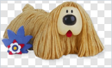
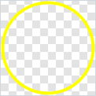
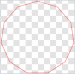
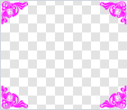
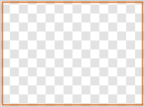
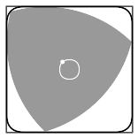
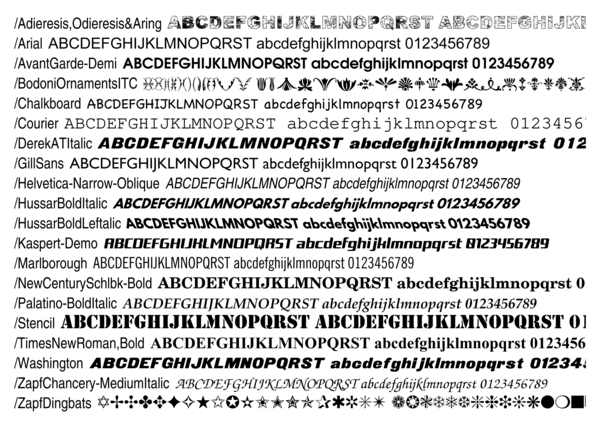
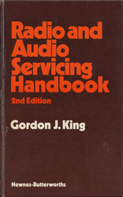
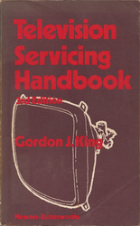
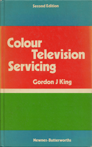

# TV Test Card Maker

### authentic replicas &bull; easily customised &bull; vector and raster formats &bull; cross-platform

## Summary


Digital imitations of vintage TV test patterns are plentiful
but accurate high-resolution and vector graphic replicas quite scarce,
and those produced by drawing tools cannot be altered because of unavailable master files.

This test card maker (TCM) recreates memorable TV test patterns
with a high level of empirical accuracy.
It exposes rendering parameters for customisation
and enables custom elements – shapes, images and text – to be superimposed anywhere.

As a novel PostScript application,
TCM demonstrates precision control of vector graphics creation
and some interesting coding paradigms that add structure and adaptability.
Indeed the implementation was key to the project rationale as an academic incentive.

Hopefully TCM may prove useful to retro TV enthusiasts and the amateur TV community,
and perhaps spark wider interest as a framework for generic pattern generation.
I hope it also champions the versatility of PostScript[^1] for creating intricate graphics and layouts.

This project is dedicated to the memory of **Gordon J. King** whose technical writings inspired so many budding electronics enthusiasts – see [dedication](#in-memoriam).


<details><summary>Table of Contents</summary>

### <ins>Table of Contents</ins>

- [Summary](#summary) &bull;
[Table&nbsp;of&nbsp;Contents](#table-of-contents)
- [Taster](#taster)
- [Aims](#aims)
- [Implementation](#implementation) &bull;
[Overview](#overview)
- [Installing](#installing)
  - [Install&nbsp;TCM](#install-tcm) &bull;
[Install&nbsp;Ghostscript](#install-ghostscript) &bull;
[Platform&nbsp;details](#platform-details)
- [PostScript&nbsp;basics](#postscript-basics)
  - [Objects](#objects) &bull;
[Operators](#operators)
- [Making&nbsp;patterns](#making-patterns)
  - [Setting&nbsp;parameters](#setting-parameters) &bull;
[Examples](#examples)
- [Pattern&nbsp;templates](#pattern-templates)
- [Compositing&nbsp;groups](#compositing-groups)
  - [Group&nbsp;composition](#group-composition) &bull;
- [Template&nbsp;elements](#template-elements)
  - [Group&nbsp;BBCbw&nbsp;elements](#group-bbcbw-elements) &bull;
[Group&nbsp;BBCgc&nbsp;elements](#group-bbcgc-elements) &bull;
[Group&nbsp;Philips&nbsp;elements](#group-philips-elements)
- [Element&nbsp;arguments](#element-arguments)
  - [BBC&#8209;A&nbsp;arguments](#bbc-a-arguments) &bull;
[BBC&#8209;C&#8209;early&nbsp;arguments](#bbc-c-early-arguments) &bull;
[BBC&#8209;C&nbsp;arguments](#bbc-c-arguments) &bull;
[BBC&#8209;C&#8209;625&nbsp;arguments](#bbc-c-625-arguments) &bull;
[BBC&#8209;D&#8209;early&nbsp;arguments](#bbc-d-early-arguments) &bull;
[BBC&#8209;D&#8209;improved&nbsp;arguments](#bbc-d-improved-arguments) &bull;
[BBC&#8209;E&nbsp;arguments](#bbc-e-arguments) &bull;
[BBC&#8209;F&#8209;early&nbsp;arguments](#bbc-f-early-arguments) &bull;
[BBC&#8209;F&#8209;optical&nbsp;arguments](#bbc-f-optical-arguments) &bull;
[BBC&#8209;F&#8209;electronic&nbsp;arguments](#bbc-f-electronic-arguments)
- [Custom&nbsp;elements](#custom-elements)
  - [CEs&nbsp;by&nbsp;example](#ces-by-example) &bull;
[CE&nbsp;example&nbsp;arguments](#ce-example-arguments)
  - [Layering](#layering)
  - [Custom&nbsp;shapes](#custom-shapes) &bull;
[Shape&nbsp;arguments](#shape-arguments)
  - [Custom&nbsp;images](#custom-images) &bull;
[Image&nbsp;arguments](#image-arguments)
  - [Custom&nbsp;text](#custom-text) &bull;
[Text&nbsp;arguments](#text-arguments)
- [Resolution](#resolution)
- [Aspect&nbsp;ratio](#aspect-ratio)
- [Scaling](#scaling)
  - [Scaling&nbsp;details](#scaling-details) &bull;
[Time&#8209;based&nbsp;scaling](#time-based-scaling) &bull;
[Proportional&nbsp;scaling](#proportional-scaling)
- [Colours](#colours)
  - [Colour&nbsp;syntax](#colour-syntax) &bull;
[Greyscale](#greyscale) &bull;
[RGB](#rgb) &bull;
[YUV](#yuv) &bull;
[HSL](#hsl) &bull;
[HSB](#hsb) &bull;
[Named&nbsp;colours](#named-colours) &bull;
[Chroma&nbsp;keying](#chroma-keying) &bull;
[Unit&nbsp;interval&nbsp;colour&nbsp;components](#unit-interval-colour-components) &bull;
[Transparency](#transparency) &bull;
[Gradients](#gradients)
- [Fonts](#fonts)
  - [Font&nbsp;resources](#font-resources) &bull;
[Listing&nbsp;fonts](#listing-fonts) &bull;
[Adding&nbsp;fonts](#adding-fonts) &bull;
[Editing&nbsp;fonts](#editing-fonts) &bull;
[Block&#8209;inverted&nbsp;fonts](#block-inverted-fonts) &bull;
[BBC&nbsp;logo&nbsp;fonts](#bbc-logo-fonts)
- [Command&nbsp;line&nbsp;interface](#command-line-interface)
  - [Options](#options)
    - [Basic&nbsp;options](#basic-options) &bull;
[Environment&nbsp;variables](#environment-variables) &bull;
[Finding&nbsp;files](#finding-files)
  - [Output&nbsp;formats](#output-formats)
    - [Vector&nbsp;formats](#vector-formats) &bull;
[PDF](#pdf) &bull;
[EPS](#eps) &bull;
[SVG](#svg)
    - [Raster&nbsp;formats](#raster-formats) &bull;
[PNG](#png) &bull;
[JPEG,&nbsp;TIFF,&nbsp;BMP](#jpeg-tiff-bmp) &bull;
[WEBM,&nbsp;GIF](#webm-gif)
    - [Video&nbsp;formats](#video-formats) &bull;
- [Video&nbsp;effects](#video-effects)
- [Test&nbsp;card&nbsp;sources](#test-card-sources)
  - [Originals](#originals) &bull;
[Reconstructions](#reconstructions)
- [In&nbsp;memoriam](#in-memoriam)
  - [Gordon&nbsp;J.&nbsp;King](#gordon-j-king) &bull;
[Tributes](#tributes)
- [Further&nbsp;reading](#further-reading)
  - [Television&nbsp;history](#television-history) &bull;
[Technical](#technical) &bull;
[Test&nbsp;cards](#test-cards) &bull;
[Community](#community) &bull;
[Related&nbsp;projects](#related-projects)
  - [Footnotes](#footnotes)

</details>

## Taster

TODO

## Aims

- make test patterns in vector graphic and high-resolution raster formats
- ensure faithful replicas of vintage test patterns (UK test cards initially)
- accurate digitisations from reliable sources, not reconstructions
- calculated frequency gratings, sinusoidal where needed, and other timings
- show overlay animations to demonstrate authentic accuracy
- indicate replication with removable watermark
- reference original test card image sources used to model replicas
- options to alter, add content, decorate, generally customise to requirements
- options to superimpose shapes, images and styled text anywhere
- enable transparency
- optionally align pattern elements to discrete analogue scanlines or digital pixels
- be robust enough to calibrate television receivers
- clear instructions and numerous examples
- guidance for generating videos with audio and making ISO images and DVDs

## Implementation

Test patterns, a.k.a. test cards, consist of graphical [elements](#template-elements)
rendered according to [arguments](#element-arguments)
and composited according to a [group](#compositing-groups) layout.
Pattern [templates](#pattern-templates) are element sets that replicate historic patterns.
All element arguments can be overridden to customise pattern features,
and additional [custom elements](#custom-elements) can be layered on top.

Patterns are created programmatically in
[PostScript](https://en.wikipedia.org/wiki/PostScript) (PS)
and generated on the command-line by [Ghostscript](https://www.ghostscript.com/) (GS).
Commands simply involve passing arguments to templates following examples in this README.

<details><summary>overview</summary>

### <ins>Overview</ins>

PostScript is an interpreted Page Description Language[^2],
somewhat underappreciated now but arguably the most concise language for computed drawing tasks like this.
Being quite vintage itself[^3], it is particularly apt for making vintage test card replicas.
Apart from its formidable control over layout and detail, it is tremendous fun!

PostScript has a rich set of graphics capabilities that accomplish the [TCM aims](#aims) in a user-centric way with minimal code.
For instance the BBC pattern graticule, corner stripes, castellations and non-sinusoidal frequency bars are all simple dashed lines, albeit wide, accomplished with the `setdash` and `lineto` PS operators.
Matrix transformations are also used extensively,
for instance the corner stripes are rotated to vertical then drawn horizontally,
mirrored in the other three quadrants by translation.
Gradient and sinusoidal fills use PS shading functions.
Image imports delegate to Anastigmatix resources[^4].

Ghostscript is an open source cross-platform PostScript interpreter.
It can output high-resolution vector and raster formats
which can be post-processed to create even more image and video formats.
The command-line interface (CLI) for TCM is the GS CLI,
and the PS code uses GS-specific procedures,
therefore other interpreters will not work without modification.

This implementation makes it easy without PS or GS expertise to modify pattern [elements](#template-elements) just by changing [arguments](#element-arguments) that control composition:
dimensions, coordinates, colours, text, frequencies, element switches, imported resources.
Arguments can be specified as command line options or read from file
and follow basic PS dictionary syntax.
To achieve this in a structured way without the benefits of object-oriented features[^5] a simple argument inheritance paradigm has been devised.

Custom elements, namely [custom shapes](#custom-shapes), [custom images](#custom-images) and [custom text](#custom-text),
are a major design feature which enable graphic shapes, images, EPS[^6] vector graphics and text objects to be placed anywhere,
each with comprehensive formatting options, in ordered layers.
For instance, captions are custom-text elements and the Carole Hersee image is a custom-image element.


</details>

> [!NOTE]
> This nomenclature of groups, elements and arguments only relates to this implementation.

## Installing

### Install TCM

Click the GitHub green <kbd>Code</kbd> button at the top of the page, then <kbd>Download ZIP</kbd>.
Unzip and copy `tcm.ps` and `Resource/` to a designated TCM directory.

### Install Ghostscript

The Ghostscript interpreter is available for most platforms:

<details><summary>platform details</summary>

#### <ins>Platform details</ins>

For native Windows, run the 64-bit AGPL release from [GS Downloads](https://ghostscript.com/releases/gsdnld.html)
and restart to update `%PATH%`\
(WSL and MSYS2 are good alternatives)

For ArchLinux and [MSYS2](https://www.msys2.org/), use Pacman\
e.g. `pacman -S mingw-w64-ucrt-x86_64-ghostscript` for Windows MSYS2

For Debian/Ubuntu and WSL, use APT\
e.g. `sudo apt-get install ghostscript`

For RPM-based Linux, use YUM\
e.g. `yum install ghostscript`

For Mac, use [MacPorts](https://www.macports.org/) (recommended) or [Homebrew](https://brew.sh/)\
e.g. `sudo port install ghostscript` for MacPorts

Further info: [GS User Guide: Installing](https://ghostscript.readthedocs.io/en/latest/Install.html)

</details>

## PostScript basics

All you need to grasp to tweak TCM patterns are the [objects](#objects) and [operators](#operators) detailed below and three basic concepts:

- PostScript uses *postfix* notation, a.k.a. Reverse Polish, where operands preceed operators –
like Forth[^7].
- PostScript is *stack-based*, where operands and intermediate results are stored on a stack
- everything is an *object* (all data and procedures, that is)
- seperate tokens with whitespace; comments begin with %


The following tables show basic object types and operators needed to modify test cards.
They are mostly intuitive and by no means exhaustive
but you really shouldn’t need to dig any further.
Many of the examples take [element arguments](#element-arguments) as operands,
for example the [`BBC-C`](#bbc-c-arguments) set.

<details><summary>objects</summary>

### <ins>Objects</ins>

| type | examples | comment |
| :--- | :--- | :--- |
| boolean | `true` `false` | these are keywords |
| numeric | `1` `-2.3` `4.5e3` | integers and reals |
| string | `(Hello)` | enclose string in `(` and `)` |
| name | `/TCh` <br> `TCh 4 div` <br> `/CCf?` | names have a slash `/` <br> drop the `/` to get named objects <br> names can have any characters |
| array | `[]` <br> `[ 1 2 3 ]` <br> `[ true 4.5 (Hi) /Lo [6 7] ]` | empty array <br> array of numbers <br> array of mixed objects |
| dictionary | `/Is? true def` <br> `/Value 8.9 def` <br> `/Text (Bye) def` <br> `/Colour /Red def` <br> `/Numbers [1 2 3] def` | these are name-object pairs <br> `def` is the *define* operator |
| null | `null` | empty or missing value |

Further info: [PLRM §3.3: Data Types and Objects](https://www.adobe.com/jp/print/postscript/pdfs/PLRM.pdf#page=48)

</details>

<details><summary>operators</summary>

### <ins>Operators</ins>

| operator | example | comment |
| ---: | :---: | :--- |
| <code>_num<sub>1</sub>_ _num<sub>2</sub>_ **add** _sum_</code> | <code>1.2 3.4 **add**</code> | return <code>_num<sub>1</sub>_ + _num<sub>2</sub>_</code> |
| <code>_num<sub>1</sub>_ _num<sub>2</sub>_ **sub** _difference_</code> | <code>9.8 7.6 **sub**</code> | return <code>_num<sub>1</sub>_ - _num<sub>2</sub>_</code> |
| <code>_num<sub>1</sub>_ _num<sub>2</sub>_ **mul** _product_</code> | <code>0.5 -4 **mul**</code> | return <code>_num<sub>1</sub>_ × _num<sub>2</sub>_</code> |
| <code>_num_ **mul2** _product_</code><sup>※</sup> | <code>Gsz **mul2**</code> | return <code>_num_ × 2</code> |
| <code>_num<sub>1</sub>_ _num<sub>2</sub>_ **div** _product_</code> | <code>5.6 3 **div**</code> | return <code>_num<sub>1</sub>_ ÷ _num<sub>2</sub>_</code> |
| <code>_num_ **div2** _quotient_</code><sup>※</sup> | <code>Glw **div2**</code> | return <code>_num_ ÷ 2</code> |
| <code>_num<sub>1</sub>_ _num<sub>2</sub>_ **mod** _remainder_</code> | <code>/S7x rand TCw **mod**</code> | return remainder of <code>_num<sub>1</sub>_ ÷ _num<sub>2</sub>_</code> |
| <code>_num_ **sq** _num_</code><sup>※</sup> | <code>CCr **sq**</code> | return <code>_num_<sup>2</sup></code> |
| <code>_num_ **sqrt** _num_</code> | <code>TCy **sqrt**</code> | return <code>√<em>num</em></code> (square root) |
| <code>_num_ **neg** _num_</code> | <code>123 **neg**</code> | return <code>-_num_</code> |
| <code>_num_ **abs** _num_</code> | <code>-99 **abs**</code> | return <code>\|_num_\|</code> (absolute value) |
| <code>_leg<sub>1</sub>_ _leg<sub>2</sub>_ **hypot** _hypot_</code><sup>※</sup> | <code>TCw TCh **hypot**</code> | return hypotenuse (root sum of squares) |
| <code>_hypot_ _leg<sub>1</sub>_ **leg** _leg<sub>2</sub>_</code><sup>※</sup> | <code>Gsz mul2 Gsz **leg**</code> | return leg (cathetus, root absolute difference of squares) |
| <code>_angle_ **sin** _real_</code> | <code>-20 **sin**</code> | return sine of <code>_angle_</code> degrees |
| <code>_angle_ **cos** _real_</code> | <code>110 **cos**</code> | return cosine of <code>_angle_</code> degrees |
| <code>_angle_ **tan** _real_</code><sup>※</sup> | <code>70 **tan**</code> | return tangent of <code>_angle_</code> degrees |
| <code>_y_ _x_ **atan** _angle_</code> | <code>123 234 **atan**</code> | return arctangent of <code>_y_ ÷ _x_</code> in degrees |
| <code>_num<sub>1</sub>_ _num<sub>2</sub>_ **min** _num_</code><sup>※</sup> | <code>1.2 3.4 **min**</code> | return minimum of <code>_num<sub>1</sub>_</code>,<code>_num<sub>2</sub>_</code> |
| <code>_num<sub>1</sub>_ _num<sub>2</sub>_ **max** _num_</code><sup>※</sup> | <code>1.2 3.4 **max**</code> | return maximum of <code>_num<sub>1</sub>_</code>,<code>_num<sub>2</sub>_</code> |
| <code>_array_ **length** _int_</code> | <code>SWc **length**</code> | return length of <code>_array_</code> |
| <code>_num_ **xGsz** _product_</code><sup>※</sup> | <code>3 **xGsz**</code> | return <code>_num_ × Gsz</code> (multiply by grid size, see [scaling](#scaling)) |
| <code>– **hGsz** _size_</code><sup>※</sup> | <code>**hGsz** Glw sub</code> | return <code>Gsz ÷ 2</code> (half grid size) |
| <code>_num_ **xGlw** _product_</code><sup>※</sup> | <code>0.6 **xGlw**</code> | return <code>_num_ × Glw</code> (multiply by grid linewidth) |
| <code>– **hGlw** _width_</code><sup>※</sup> | <code>hGsz **hGlw** add</code> | return <code>Glw ÷ 2</code> (half grid linewidth) |
| <code>_freq_ **mhz** _width_</code><sup>※</sup> | <code>2.5 **mhz**</code> | return period width corresponding to MHz of active line time |
| <code>_time_ **us** _width_</code><sup>※</sup> | <code>0.25 **us**</code> | return width corresponding to μs of active line time |
| <code>_num_ **lines** _height_</code><sup>※</sup> | <code>7 **lines**</code> | return height corresponding to number of scan lines |
| <code>– **rand** _int_</code>| <code>/S7x **rand** TCw mod arg</code> | return random number <code>_int_</code> |
| <code>_int_ **srand** —</code> | <code>23 **srand**</code> | seed the random number generator with <code>_int_</code> |
| <code>_name_ _value_ **arg** –</code><sup>※</sup> | <code>/IDh hGsz **arg**</code> | define argument (name-object pair) iff not already defined |
| <code>_to_ _from_ **merge** –</code><sup>※</sup> | <code>/T7 /T4 **merge**</code> | define undefined args from another custom element of same type |

<sup>※</sup> TCM operators, as opposed to PS built-in operators

Further info: [PLRM §8: Operators](https://www.adobe.com/jp/print/postscript/pdfs/PLRM.pdf#page=519)

</details>

## Making patterns

### Setting parameters

### Examples

`gs -q -IResource -sDEVICE=pdfwrite -o fe.pdf tcm.ps`\
makes the default *BBC-F-electronic* pattern as a PDF file `fe.pdf`

`gs -q -IResource -sDEVICE=eps2write -o c.eps -dTC=/BBC-C tcm.ps`\
makes the long-running 405-line *BBC-C* pattern as an EPS file `c.eps`

`gs -q -IResource -sDEVICE=pnggray -o c625.png -dTC=/BBC-C-625 tcm.ps`\
makes the 625-line *BBC-C-625* pattern as a greyscale PNG file `c625.png`

`gs -q -IResource -sDEVICE=pngalpha -o fo.png -dTC=/BBC-F-optical -dCPi=null tcm.ps`\
makes the double-slide *BBC-F-optical* pattern as a PNG file `fo.png`
with a transparent hole where the image should be (see [arguments](#bbc-f-optical-arguments))

## Pattern templates

These are the replica test card patterns composited so far.
All pattern elements can easily be adjusted or customised.

The thumbnails link to larger animated images showing replica and original overlaid, for testing.\
By default a replica icon  in the bottom-right corner watermarks the replica pattern.

<kbd align='center'>&nbsp;<br>**BBC-A**<br>&nbsp;<br>[](assets/templates/BBC-A-anim.gif)</kbd>
<kbd align='center'>&nbsp;<br>**BBC-C-early**<br>&nbsp;<br>[](assets/templates/BBC-C-early-anim.gif)</kbd>
<kbd align='center'>&nbsp;<br>**BBC-C**<br>&nbsp;<br>[](assets/templates/BBC-C-anim.gif)</kbd>
<kbd align='center'>&nbsp;<br>**BBC-D-early**<br>&nbsp;<br>[](assets/templates/BBC-D-early-anim.gif)</kbd>
<kbd align='center'>&nbsp;<br>**BBC-D-improved**<br>&nbsp;<br>[](assets/templates/BBC-D-improved-anim.gif)</kbd>
<kbd align='center'>&nbsp;<br>**BBC-E**<br>&nbsp;<br>[](assets/templates/BBC-E-anim.gif)</kbd>
<kbd align='center'>&nbsp;<br>**BBC-C-625**<br>&nbsp;<br>[](assets/templates/BBC-C-625-anim.gif)</kbd>
<kbd align='center'>&nbsp;<br>**BBC-F-early**<br>&nbsp;<br>[](assets/templates/BBC-F-early-anim.gif)</kbd>
<kbd align='center'>&nbsp;<br>**BBC-F-optical**<br>&nbsp;<br>[](assets/templates/BBC-F-optical-anim.gif)</kbd>
<kbd align='center'>&nbsp;<br>**BBC-F-electronic**<br>&nbsp;<br>[](assets/templates/BBC-F-electronic-anim.gif)</kbd>


International and widescreen patterns may follow if called for
but many modern digital test patterns exist already.

## Compositing groups

A compositing group is a set of visibly similar templates that share a common layout of graphic [elements](#template-elements) and their respective [arguments](#element-arguments).
Each group has its own procedure resource for compositing all patterns in the group.
Grouping enables TCM to generate widely differing patterns and provides extensibility.

<details><summary>group composition</summary>

### <ins>Group composition</ins>

| group | patterns | templates |
| :--- | :--- | :--- |
| `BBCbw` | black and white BBC patterns | BBC A (B *TBD*) |
| `BBCgc` | greyscale and colour BBC patterns | BBC C, D, E, F, J (W, X *TBD*) |
| `Philips` | Philips circle pattern[^8] | BBC pattern G (*TBD*) |


</details>

## Template elements

These are graphic components that make up the test pattern,
such as the graticule, letterbox, step wedge, corner stripes, border.

<details><summary>group <code>BBCbw</code> elements</summary>

### <ins>Group <code>BBCbw</code> elements</ins>
</details>

<details><summary>group <code>BBCgc</code> elements</summary>

### <ins>Group <code>BBCgc</code> elements</ins>
</details>

<details><summary>group <code>Philips</code> elements</summary>

### <ins>Group <code>Philips</code> elements</ins>
</details>

## Element arguments

These variables follow a naming convention where upper-case letters denote the element
and lower-case letters denote the parameter,
for instance `TCbc` is the test card background colour and `SWw` is the step wedge width.
A question mark denotes a switch, for instance `PP?` controls whether pulse panes are drawn.

The following tables show element arguments for each template and the hierarchy for inherited arguments.

<details><summary><code>BBC-A</code> arguments</summary>

### <ins><code>BBC-A</code> arguments</ins>

Inheritance: `BBC-A` <— Blank
| arg | value | description |
| ---: | :---: | :--- |
| ***/TC…*** |  | ***test card arguments*** |
| `/TCorg` | `/BBC` | organisation |
| `/TCid` | `/A` | designation letter |
| `/TCv` | `null` | version |
| `/TCg` | `/BBCbw` | compositing group |
| `/TCbc` | `/white` | background colour |
| `/TC?` | `true` | false for no pattern elements, custom elements only |
| ***/G…*** |  | ***graticule arguments*** |
| `/Gsz` | `TCh 16.5 div` | grid size: datum for all measurements |
| `/Gszh` | `TCw 20.5 div` | horizontal grid size |
| ***/LB…*** |  | ***letterbox arguments*** |
| `/LBiw` | `3.2 xGsz` | letterbox inner width |
| `/LBih` | `0.55 xGsz` | letterbox inner height |
| `/LBy` | `TCy 4.8 xGsz sub` | letterbox vertical centre |
| `/LBc` | `/black` | letterbox colours: [inner outer] |
| ***/CC…*** |  | ***centre circles arguments*** |
| `/CClw` | `0.8 xGsz` | centre circles stroke width |
| `/CCr` | `2.79 xGsz` | white circle stroke radius |
| ***/ID…*** |  | ***ident designation arguments*** |
| `/IDs` | `(A)` | ident string: empty for no ident |
| `/IDf` | `/GillSans-alt` | ident font |
| `/IDc` | `/black` | ident colour |
| `/IDh` | `Gsz` | ident height |
| `/IDx` | `TCx` | ident horizontal centre |
| `/IDy` | `TCy 5.95 xGsz sub` | ident vertical centre |
| ***/FB…*** |  | ***frequency bars arguments*** |
| `/FBh` | `3.2 xGsz` | freq bars height |
| `/FBc` | `/black` | freq bars colours: grating between surround |
| `/FBx` | `TCx 5.2 xGsz sub` | freq bars horizontal centre |
| `/FBf` | `[ [1 6 -1 /T-2 1] [1.5 6 1 /T-3 1] [2 6 -1 /T-4 -1] [2.5 6 0 /T-1 0] [3 6 1 /T-5 -1] ]` | frequencies: [MHz nbars antiphase] array |
| ***/NP…*** |  | ***needle pulse line arguments*** |
| `/NPh` | `FBh` | needle pulse line height |
| `/NPx` | `TCx 6.4 xGsz sub` | needle pulse line horizontal centre |
| `/NPc` | `/black` |  |
| ***/B…*** |  | ***border arguments*** |
| `/Bw` | `0.565 xGsz` | border width |

</details>

<details><summary><code>BBC-C-early</code> arguments</summary>

### <ins><code>BBC-C-early</code> arguments</ins>

Inheritance: `BBC-C-early` <— Blank
| arg | value | description |
| ---: | :---: | :--- |
| ***/TC…*** |  | ***test card arguments*** |
| `/TCorg` | `/BBC` | organisation |
| `/TCid` | `/C` | designation letter |
| `/TCv` | `/early` | version |
| `/TCg` | `/BBCgc` | compositing group |
| `/TCbc` | `0.6` | background colour |
| `/TC?` | `true` | false for no pattern elements, custom elements only |
| ***/G…*** |  | ***graticule arguments*** |
| `/Gsz` | `TCh 0.129 mul` | grid size: datum for all measurements |
| `/Glw` | `Gsz 12 div` | grid linewidth |
| `/Golw` | `0` | grid outline width: 0 for no outline (F/J/W/X pattern) |
| `/Gps?` | `false` | true to shift grid phase by half a square |
| `/Glc` | `/white` | grid line colour |
| `/G?` | `true` | false for no graticule |
| ***/LB…*** |  | ***letterbox arguments*** |
| `/LBow` | `2.66 xGsz` | letterbox outer width |
| `/LBoh` | `0.89 xGsz` | letterbox outer height |
| `/LBiw` | `1.75 xGsz` | letterbox inner width |
| `/LBih` | `0.31 xGsz` | letterbox inner height |
| `/LBy` | `TCy 2.81 xGsz add` | letterbox vertical centre |
| `/LBc` | `[/black /white]` | letterbox colours: [inner outer] |
| `/LB?` | `true` | false for no letterbox |
| ***/PP…*** |  | ***pulse pane arguments*** |
| `/PPw` | `2 xGsz Glw add` | pulse pane width |
| `/PPh` | `3 xGsz Glw add` | pulse pane height |
| `/PPx` | `TCx 2 xGsz sub` | pulse pane horizontal centre |
| `/PPc` | `[/black /white]` | pulse pane colours: [left right] |
| `/PP?` | `true` | false for no pulse panes or needle pulse lines |
| ***/NP…*** |  | ***needle pulse line arguments*** |
| `/NPw` | `0.25 us` | needle pulse linewidth |
| `/NPh` | `1.8 xGsz` | needle pulse line height |
| `/NPx` | `PPx 0.725 xGsz sub` | needle pulse line horizontal centre |
| ***/ID…*** |  | ***ident designation arguments*** |
| `/IDs` | `(C)` | ident string: empty for no ident |
| `/IDf` | `/GillSans` | ident font |
| `/IDc` | `/white` | ident colour |
| `/IDh` | `0.63 xGsz` | ident height |
| `/IDx` | `TCx 0.07 xGsz sub` | ident horizontal centre |
| `/IDy` | `TCy 3 xGsz sub` | ident vertical centre |
| `/IDdr` | `0` | ident adjacent dot radius: 0 for none |
| ***/C…*** |  | ***caption arguments*** |
| `/Ct` | `[]` | caption custom text element names: empty for no caption |
| `/Cy` | `TCy 3 xGsz sub` | caption vertical centre |
| `/Cr` | `1` | caption rectangle graticule rows |
| `/Cc` | `2` | caption rectangle graticule columns |
| `/Cch` | `1` | caption rectangle clip height scale factor |
| ***/CC…*** |  | ***centre circles arguments*** |
| `/CCf?` | `true` | false for no fill (empty) |
| `/CClw` | `0.1 xGsz` | centre circles stroke width |
| `/CCr` | `2 xGsz` | white circle stroke radius |
| `/CCbr` | `CCr CClw add` | black circle stroke radius: 0 for none |
| `/CCor` | `CCr CClw mul2 add` | outer circle stroke radius: 0 for none |
| `/CC?` | `true` | false for no circles |
| ***/CP…*** |  | ***centre picture arguments*** |
| `/CPi` | `null` | picture custom image element name, null for no image |
| ***/SW…*** |  | ***step wedge arguments*** |
| `/SWx` | `TCx` | step wedge horizontal centre |
| `/SWw` | `0.5 xGsz` | step wedge width |
| `/SWoh` | `2.5 xGsz` | step wedge outer height |
| `/SWc` | `[0 0.3 0.5 0.7 1]` | step wedge colours: [bottom to top] |
| `/SWds` | `0` | step wedge dot size 0 for none, diameter or [width height] array |
| `/SWdc` | `[0.2 1]` | step wedge dot colours: [bottom top] |
| `/SW?` | `true` | false for no step wedge |
| ***/FB…*** |  | ***frequency bars arguments*** |
| `/FB2?` | `true` | true for 2 bars, false for 1 |
| `/FBoh` | `PPh` | freq bar outer height |
| `/FBow` | `SWw` | freq bar outer width |
| `/FBh` | `0.505 xGsz` | freq bars height |
| `/FBg` | `0` | freq bars gap size (>0 for D/E) |
| `/FBp` | `0.012 xGsz` | freq bars padding |
| `/FBc` | `[0 1 1]` | freq bars colours: grating between surround |
| `/FBs?` | `false` | true for sinusoidal frequency gratings, false for square |
| `/FBx` | `TCx CCr CClw 0.4 mul sub FBoh div2 leg sub FBow div2 add` | freq bars horizontal centre |
| `/FBf` | `[ [1 4 0] [1.5 6 0] [2 8 0] [2.5 10 0] [3 12 0] ]` | frequencies: [MHz nbars antiphase] array |
| `/FBt` | `null` | custom text element name for freq text template, null for no text |
| `/FB?` | `true` | false for no frequency bars |
| ***/CS…*** |  | ***corner stripes arguments*** |
| `/CSa` | `1 TCr atan` | corner stripes angle from horizontal |
| `/CSol` | `3.03 xGsz` | corner stripes outer length from corner |
| `/CSow` | `Gsz` | corner stripes outer width |
| `/CShf` | `0.9` | corner stripes horizontal fundamental MHz |
| `/CSlw` | `CShf mhz div2 1 TCar atan sin mul` | corner stripes linewidth at normal aspect ratio |
| `/CSnl` | `10` | corner stripes number of lines |
| `/CSep` | `Glw` | corner stripes end padding |
| `/CSbp` | `Glw` | corner stripes border padding (clipped) |
| `/CSc` | `[/black /white]` | corner stripes colours: [grating surround] |
| `/CSs?` | `false` | true for sinusoidal corner stripes false for square |
| `/CS?` | `true` | false for no corner stripes |
| ***/CB…*** |  | ***colour bar arguments*** |
| `/CBh` | `0` | colour bar height: 0 for no colour bars (fraction of border width) |
| `/CBc` | `[/white /yellow /cyan /green /magenta /red /blue /black]` | colour bar colours: [left to right] |
| `/CBew` | `0` | colour bar end widths (fraction of uniform inner widths) |
| ***/B…*** |  | ***border arguments*** |
| `/Bw` | `0.26 xGsz` | border width |
| `/Ba?` | `false` | false for no arrows |
| `/Bah?` | `true` | true for half-size arrows |
| `/Bac` | `[1 0]` | arrow colours: [horizontal vertical] |
| `/Bcc` | `[]` | castellation colours: empty or [left-red left-blue bottom-green right-yellow top-cyan] |
| `/B?` | `true` | false for no drawn border |

</details>

<details><summary><code>BBC-C</code> arguments</summary>

### <ins><code>BBC-C</code> arguments</ins>

Inheritance: `BBC-C` <— [`BBC-C-early`](#bbc-c-early-arguments) <— Blank
| arg | value | description |
| ---: | :---: | :--- |
| ***/TC…*** |  | ***test card arguments*** |
| `/TCv` | `null` | version |
| ***/G…*** |  | ***graticule arguments*** |
| `/Gsz` | `TCh 0.129 mul` | grid size: datum for all measurements |
| ***/LB…*** |  | ***letterbox arguments*** |
| `/LBih` | `0.28 xGsz` | letterbox inner height |
| ***/ID…*** |  | ***ident designation arguments*** |
| `/IDf` | `/TCM-BBC_C-SemiBold` | ident font |
| `/IDh` | `0.69 xGsz` | ident height |
| `/IDx` | `TCx 0.02 xGsz sub` | ident horizontal centre |
| ***/C…*** |  | ***caption arguments*** |
| `/Ct` | `[/T-1]` | caption custom text element names: empty for no caption |
| ***/SW…*** |  | ***step wedge arguments*** |
| `/SWoh` | `2.55 xGsz` | step wedge outer height |
| `/SWw` | `0.52 xGsz` | step wedge width |
| ***/NP…*** |  | ***needle pulse line arguments*** |
| `/NPx` | `PPx 0.7 xGsz sub` | needle pulse line horizontal centre |
| ***/CC…*** |  | ***centre circles arguments*** |
| `/CCor` | `CCr CClw 1.9 mul add` | outer circle stroke radius: 0 for none |
| ***/FB…*** |  | ***frequency bars arguments*** |
| `/FBh` | `0.53 xGsz` | freq bars height |
| `/FBp` | `0.02 xGsz` | freq bars padding |
| ***/CS…*** |  | ***corner stripes arguments*** |
| `/CSol` | `3.08 xGsz` | corner stripes outer length from corner |
| ***/B…*** |  | ***border arguments*** |
| `/Bw` | `0.29 xGsz` | border width |
| `/Ba?` | `true` | false for no arrows |
| `/Bah?` | `true` | true for half-size arrows |

</details>

<details><summary><code>BBC-C-625</code> arguments</summary>

### <ins><code>BBC-C-625</code> arguments</ins>

Inheritance: `BBC-C-625` <— [`BBC-C`](#bbc-c-arguments) <— [`BBC-C-early`](#bbc-c-early-arguments) <— Blank
| arg | value | description |
| ---: | :---: | :--- |
| ***/TC…*** |  | ***test card arguments*** |
| `/TCv` | `/625` | version |
| `/TCbc` | `0.53` | background colour |
| ***/G…*** |  | ***graticule arguments*** |
| `/Gsz` | `TCh 7.79 div` | grid size: datum for all measurements |
| `/Glw` | `Gsz 12 div` | grid linewidth |
| ***/LB…*** |  | ***letterbox arguments*** |
| `/LBy` | `TCy 2.8 xGsz add` | letterbox vertical centre |
| `/LBoh` | `0.89 xGsz` | letterbox outer height |
| `/LBow` | `2.68 xGsz` | letterbox outer width |
| ***/NP…*** |  | ***needle pulse line arguments*** |
| `/NPx` | `TCx 2.74 xGsz sub` | needle pulse line horizontal centre |
| `/NPw` | `0.2 us` | needle pulse linewidth |
| ***/ID…*** |  | ***ident designation arguments*** |
| `/IDs` | `()` | ident string: empty for no ident |
| ***/C…*** |  | ***caption arguments*** |
| `/Cc` | `7` | caption rectangle graticule columns |
| `/Ct` | `[/T-3 /T-4]` | caption custom text element names: empty for no caption |
| ***/CC…*** |  | ***centre circles arguments*** |
| `/CClw` | `0.12 xGsz` | centre circles stroke width |
| `/CCr` | `2.01 xGsz` | white circle stroke radius |
| `/CCbr` | `CCr CClw add` | black circle stroke radius: 0 for none |
| `/CCor` | `CCr CClw 1.8 mul add` | outer circle stroke radius: 0 for none |
| ***/SW…*** |  | ***step wedge arguments*** |
| `/SWoh` | `2.67 xGsz` | step wedge outer height |
| `/SWw` | `0.535 xGsz` | step wedge width |
| `/SWc` | `[0 0.33 0.5 0.8 1]` | step wedge colours: [bottom to top] |
| ***/FB…*** |  | ***frequency bars arguments*** |
| `/FBow` | `0.6 xGsz` | freq bar outer width |
| `/FBh` | `0.525 xGsz` | freq bars height |
| `/FBg` | `0` | freq bars gap size (>0 for D/E) |
| `/FBp` | `0.023 xGsz` | freq bars padding |
| `/FBoh` | `3 xGsz Glw add` | freq bar outer height |
| `/FBx` | `TCx CCr CClw 0.1 mul sub FBoh div2 leg sub FBow div2 add` | freq bars horizontal centre |
| `/FBf` | `[ [1.5 4 0] [2.5 7 0] [3.75 10 0] [4.5 12 0] [5.25 14 0] ]` | frequencies: [MHz nbars antiphase] array |
| `/FBt` | `/T-1` | custom text element name for freq text template, null for no text |
| ***/CS…*** |  | ***corner stripes arguments*** |
| `/CSol` | `3.11 xGsz` | corner stripes outer length from corner |
| `/CShf` | `1.3` | corner stripes horizontal fundamental MHz |
| ***/B…*** |  | ***border arguments*** |
| `/Bw` | `0.29 xGsz` | border width |
| `/Bah?` | `false` | true for half-size arrows |
| ***/X…*** |  | ***extra processing arguments*** |
| `/Xp` | `{ Mcs }` | extra procs (use unique proc names and def not arg, for md) |

</details>

<details><summary><code>BBC-D-early</code> arguments</summary>

### <ins><code>BBC-D-early</code> arguments</ins>

Inheritance: `BBC-D-early` <— [`BBC-C-early`](#bbc-c-early-arguments) <— Blank
| arg | value | description |
| ---: | :---: | :--- |
| ***/TC…*** |  | ***test card arguments*** |
| `/TCid` | `/D` | designation letter |
| `/TCv` | `/early` | version |
| ***/G…*** |  | ***graticule arguments*** |
| `/Gsz` | `TCh 9 div` | grid size: datum for all measurements |
| `/Glw` | `Gsz 0.1 mul` | grid linewidth |
| `/Gps?` | `true` | true to shift grid phase by half a square |
| ***/LB…*** |  | ***letterbox arguments*** |
| `/LBow` | `3.45 xGsz` | letterbox outer width |
| `/LBoh` | `0.9 xGsz` | letterbox outer height |
| `/LBiw` | `2.2 xGsz` | letterbox inner width |
| `/LBih` | `0.4 xGsz` | letterbox inner height |
| `/LBy` | `TCy 3 xGsz add` | letterbox vertical centre |
| ***/PP…*** |  | ***pulse pane arguments*** |
| `/PPw` | `Gsz Glw add` | pulse pane width |
| `/PPh` | `2.9 xGsz Glw add` | pulse pane height |
| `/PPx` | `TCx 4 xGsz sub dup Gsz lt { Gsz add } if` | pulse pane horizontal centre |
| `/PPc` | `[/white /black]` | pulse pane colours: [left right] |
| ***/NP…*** |  | ***needle pulse line arguments*** |
| `/NPw` | `0.3 us` | needle pulse linewidth |
| `/NPx` | `PPx` | needle pulse line horizontal centre |
| ***/ID…*** |  | ***ident designation arguments*** |
| `/IDs` | `(D)` | ident string: empty for no ident |
| `/IDf` | `/GillSans` | ident font |
| `/IDh` | `0.52 xGsz` | ident height |
| `/IDy` | `TCy 2.62 xGsz sub` | ident vertical centre |
| `/IDx` | `TCx 0.02 xGsz add` | ident horizontal centre |
| ***/C…*** |  | ***caption arguments*** |
| `/Cy` | `TCy 3.5 xGsz sub` | caption vertical centre |
| `/Cc` | `7` | caption rectangle graticule columns |
| `/Cch` | `0.85` | caption rectangle clip height scale factor |
| `/Ct` | `[/T-1 /T-2]` | caption custom text element names: empty for no caption |
| ***/CC…*** |  | ***centre circles arguments*** |
| `/CClw` | `0.1 xGsz` | centre circles stroke width |
| `/CCr` | `2.05 xGsz` | white circle stroke radius |
| `/CCbr` | `CCr CClw add` | black circle stroke radius: 0 for none |
| `/CCor` | `CCr CClw mul2 add` | outer circle stroke radius: 0 for none |
| ***/SW…*** |  | ***step wedge arguments*** |
| `/SWw` | `0.593 xGsz` | step wedge width |
| `/SWoh` | `2.965 xGsz` | step wedge outer height |
| `/SWc` | `[0 0.33 0.55 0.75 0.95]` | step wedge colours: [bottom to top] |
| `/SWds` | `1.6 xGlw` | step wedge dot size 0 for none, diameter or [width height] array |
| ***/FB…*** |  | ***frequency bars arguments*** |
| `/FBow` | `Gsz Glw sub` | freq bar outer width |
| `/FBh` | `0.53 xGsz` | freq bars height |
| `/FBoh` | `1.8 xGsz` | freq bar outer height |
| `/FBx` | `TCx 1.58 xGsz sub FBow div2 add` | freq bars horizontal centre |
| `/FBg` | `FBoh FBh 3 mul sub div2` | freq bars gap size (>0 for D/E) |
| `/FBp` | `0.075 xGsz` | freq bars padding |
| `/FBf` | `[ [1 5 0] [1.5 7 1] [2 9 1] [2.5 12 0] [2.75 13 0] [3 14 0] ]` | frequencies: [MHz nbars antiphase] array |
| ***/CS…*** |  | ***corner stripes arguments*** |
| `/CSa` | `45` | corner stripes angle from horizontal |
| `/CSol` | `3.31 xGsz` | corner stripes outer length from corner |
| `/CSow` | `1.05 xGsz` | corner stripes outer width |
| `/CSnl` | `8` | corner stripes number of lines |
| `/CSep` | `1.2 xGlw` | corner stripes end padding |
| `/CShf` | `1.0` | corner stripes horizontal fundamental MHz |
| `/CSlw` | `CShf mhz div2 CSa sin mul` | corner stripes linewidth at normal aspect ratio |
| ***/B…*** |  | ***border arguments*** |
| `/Bw` | `{ TCh 8 xGsz Glw add sub div2 }` | border width |
| `/Ba?` | `true` | false for no arrows |
| `/Bah?` | `false` | true for half-size arrows |

</details>

<details><summary><code>BBC-D-improved</code> arguments</summary>

### <ins><code>BBC-D-improved</code> arguments</ins>

Inheritance: `BBC-D-improved` <— [`BBC-D-early`](#bbc-d-early-arguments) <— [`BBC-C-early`](#bbc-c-early-arguments) <— Blank
| arg | value | description |
| ---: | :---: | :--- |
| ***/TC…*** |  | ***test card arguments*** |
| `/TCv` | `/improved` | version |
| ***/ID…*** |  | ***ident designation arguments*** |
| `/IDdr` | `0.07 xGsz` | ident adjacent dot radius: 0 for none |
| ***/C…*** |  | ***caption arguments*** |
| `/Ct` | `[/T-1 /T-2]` | caption custom text element names: empty for no caption |

</details>

<details><summary><code>BBC-E</code> arguments</summary>

### <ins><code>BBC-E</code> arguments</ins>

Inheritance: `BBC-E` <— [`BBC-D-early`](#bbc-d-early-arguments) <— [`BBC-C-early`](#bbc-c-early-arguments) <— Blank
| arg | value | description |
| ---: | :---: | :--- |
| ***/TC…*** |  | ***test card arguments*** |
| `/TCid` | `/E` | designation letter |
| `/TCv` | `null` | version |
| `/TCbc` | `0.5` | background colour |
| ***/G…*** |  | ***graticule arguments*** |
| `/Glw` | `7 lines` | grid linewidth |
| ***/NP…*** |  | ***needle pulse line arguments*** |
| `/NPw` | `0.2 us` | needle pulse linewidth |
| ***/ID…*** |  | ***ident designation arguments*** |
| `/IDs` | `(E)` | ident string: empty for no ident |
| `/IDy` | `TCy 2.6 xGsz sub` | ident vertical centre |
| ***/SW…*** |  | ***step wedge arguments*** |
| `/SWds` | `1.3 xGlw` | step wedge dot size 0 for none, diameter or [width height] array |
| ***/FB…*** |  | ***frequency bars arguments*** |
| `/FBh` | `0.55 xGsz` | freq bars height |
| `/FBc` | `[ 0.2 0.95 0.75 ]` | freq bars colours: grating between surround |
| `/FBf` | `[ [1.5 5 0] [2.5 9 0] [3.5 11 0] [4 13 0] [4.5 15 0] [5.25 17 0] ]` | frequencies: [MHz nbars antiphase] array |
| `/FBs?` | `true` | true for sinusoidal frequency gratings, false for square |
| ***/CS…*** |  | ***corner stripes arguments*** |
| `/CShf` | `1.5` | corner stripes horizontal fundamental MHz |

</details>

<details><summary><code>BBC-F-early</code> arguments</summary>

### <ins><code>BBC-F-early</code> arguments</ins>

Inheritance: `BBC-F-early` <— [`BBC-E`](#bbc-e-arguments) <— [`BBC-D-early`](#bbc-d-early-arguments) <— [`BBC-C-early`](#bbc-c-early-arguments) <— Blank
| arg | value | description |
| ---: | :---: | :--- |
| ***/TC…*** |  | ***test card arguments*** |
| `/TCid` | `/F` | designation letter |
| `/TCv` | `/early` | version |
| ***/G…*** |  | ***graticule arguments*** |
| `/Glw` | `8 lines` | grid linewidth |
| `/Golw` | `0.42 xGlw` | grid outline width: 0 for no outline (F/J/W/X pattern) |
| ***/CP…*** |  | ***centre picture arguments*** |
| `/CPi` | `/I-1` | picture custom image element name, null for no image |
| ***/LB…*** |  | ***letterbox arguments*** |
| `/LBow` | `3.45 xGsz` | letterbox outer width |
| `/LBoh` | `0.9 xGsz` | letterbox outer height |
| `/LBiw` | `2.1 xGsz` | letterbox inner width |
| `/LBih` | `0.45 xGsz` | letterbox inner height |
| ***/PP…*** |  | ***pulse pane arguments*** |
| `/PP?` | `false` | false for no pulse panes or needle pulse lines |
| ***/ID…*** |  | ***ident designation arguments*** |
| `/IDs` | `(F)` | ident string: empty for no ident |
| `/IDf` | `/Helvetica-Narrow-Bold` | ident font |
| `/IDh` | `0.38 xGsz` | ident height |
| `/IDx` | `TCx` | ident horizontal centre |
| `/IDy` | `TCy 2.71 xGsz sub` | ident vertical centre |
| `/IDdr` | `0` | ident adjacent dot radius: 0 for none |
| ***/C…*** |  | ***caption arguments*** |
| `/Ct` | `[]` | caption custom text element names: empty for no caption |
| ***/CC…*** |  | ***centre circles arguments*** |
| `/CCf?` | `false` | false for no fill (empty) |
| `/CClw` | `0.9 xGlw` | centre circles stroke width |
| `/CCr` | `2.5 xGsz 0.8 xGlw sub` | white circle stroke radius |
| `/CCbr` | `0` | black circle stroke radius: 0 for none |
| `/CCor` | `0` | outer circle stroke radius: 0 for none |
| ***/SW…*** |  | ***step wedge arguments*** |
| `/SWw` | `Gsz Glw sub` | step wedge width |
| `/SWx` | `lGx 2 xGsz add TCx 3 xGsz sub min` | step wedge horizontal centre |
| `/SWc` | `[0 0.2 0.3 0.4 0.6 0.85]` | step wedge colours: [bottom to top] |
| `/SWoh` | `4 xGsz Glw sub` | step wedge outer height |
| `/SWds` | `1.2 xGlw` | step wedge dot size 0 for none, diameter or [width height] array |
| ***/FB…*** |  | ***frequency bars arguments*** |
| `/FB2?` | `false` | true for 2 bars, false for 1 |
| `/FBow` | `SWw` | freq bar outer width |
| `/FBh` | `SWoh SWc length div` | freq bars height |
| `/FBx` | `TCx SWx sub TCx add` | freq bars horizontal centre |
| `/FBg` | `0` | freq bars gap size (>0 for D/E) |
| `/FBp` | `0` | freq bars padding |
| `/FBc` | `[0 1 1]` | freq bars colours: grating between surround |
| `/FBf` | `[ [1.5 6 0] [2.5 9 0] [3.5 13 0] [4 15 0] [4.5 17 0] [5.25 20 0] ]` | frequencies: [MHz nbars antiphase] array |
| `/FBs?` | `false` | true for sinusoidal frequency gratings, false for square |
| `/FBoh` | `FBh FBf length mul` | freq bar outer height |
| `/FBt` | `/T-1` | custom text element name for freq text template, null for no text |
| ***/CS…*** |  | ***corner stripes arguments*** |
| `/CSol` | `2.73 xGsz` | corner stripes outer length from corner |
| `/CSow` | `1.1 xGsz` | corner stripes outer width |
| `/CSep` | `Glw` | corner stripes end padding |
| ***/CB…*** |  | ***colour bar arguments*** |
| `/CBh` | `0` | colour bar height: 0 for no colour bars (fraction of border width) |
| ***/B…*** |  | ***border arguments*** |
| `/Bac` | `[1 1]` | arrow colours: [horizontal vertical] |
| `/Bcc` | `[ [ 250 19 30 ] [ 27 85 157 ] [ 40 107 47 ] [ 254 203 33 ] [ 17 133 222 ] ]` | castellation colours: empty or [left-red left-blue bottom-green right-yellow top-cyan] |

</details>

<details><summary><code>BBC-F-optical</code> arguments</summary>

### <ins><code>BBC-F-optical</code> arguments</ins>

Inheritance: `BBC-F-optical` <— [`BBC-F-early`](#bbc-f-early-arguments) <— [`BBC-E`](#bbc-e-arguments) <— [`BBC-D-early`](#bbc-d-early-arguments) <— [`BBC-C-early`](#bbc-c-early-arguments) <— Blank
| arg | value | description |
| ---: | :---: | :--- |
| ***/TC…*** |  | ***test card arguments*** |
| `/TCv` | `/optical` | version |
| ***/G…*** |  | ***graticule arguments*** |
| `/Glw` | `7 lines` | grid linewidth |
| `/Golw` | `0.5 xGlw` | grid outline width: 0 for no outline (F/J/W/X pattern) |
| ***/ID…*** |  | ***ident designation arguments*** |
| `/IDy` | `TCy 2.7 xGsz sub` | ident vertical centre |
| ***/CB…*** |  | ***colour bar arguments*** |
| `/CBh` | `0.75` | colour bar height: 0 for no colour bars (fraction of border width) |
| `/CBew` | `0.78` | colour bar end widths (fraction of uniform inner widths) |
| ***/C…*** |  | ***caption arguments*** |
| `/Ct` | `[/T-1 /T-2]` | caption custom text element names: empty for no caption |
| ***/LB…*** |  | ***letterbox arguments*** |
| `/LBih` | `0.4 xGsz` | letterbox inner height |
| `/LBiw` | `2.23 xGsz` | letterbox inner width |
| ***/CC…*** |  | ***centre circles arguments*** |
| `/CCr` | `2.5 xGsz 0.88 xGlw sub` | white circle stroke radius |
| ***/FB…*** |  | ***frequency bars arguments*** |
| `/FBt` | `null` | custom text element name for freq text template, null for no text |

</details>

<details><summary><code>BBC-F-electronic</code> arguments</summary>

### <ins><code>BBC-F-electronic</code> arguments</ins>

Inheritance: `BBC-F-electronic` <— [`BBC-F-optical`](#bbc-f-optical-arguments) <— [`BBC-F-early`](#bbc-f-early-arguments) <— [`BBC-E`](#bbc-e-arguments) <— [`BBC-D-early`](#bbc-d-early-arguments) <— [`BBC-C-early`](#bbc-c-early-arguments) <— Blank
| arg | value | description |
| ---: | :---: | :--- |
| ***/TC…*** |  | ***test card arguments*** |
| `/TCv` | `/electronic` | version |
| ***/G…*** |  | ***graticule arguments*** |
| `/Glw` | `5 lines` | grid linewidth |
| `/Golw` | `0.65 xGlw` | grid outline width: 0 for no outline (F/J/W/X pattern) |
| ***/CC…*** |  | ***centre circles arguments*** |
| `/CCr` | `2.5 xGsz 1.15 xGlw sub` | white circle stroke radius |
| `/CClw` | `1.33 xGlw` | centre circles stroke width |
| ***/ID…*** |  | ***ident designation arguments*** |
| `/IDf` | `/Sanchez-Regular` | ident font |
| `/IDh` | `0.39 xGsz` | ident height |
| `/IDy` | `TCy 2.71 xGsz sub` | ident vertical centre |
| ***/C…*** |  | ***caption arguments*** |
| `/Ct` | `[/T-2 /T-3]` | caption custom text element names: empty for no caption |
| `/Cch` | `1` | caption rectangle clip height scale factor |
| ***/LB…*** |  | ***letterbox arguments*** |
| `/LBoh` | `0.87 xGsz` | letterbox outer height |
| `/LBih` | `0.39 xGsz` | letterbox inner height |
| `/LBiw` | `2.2 xGsz` | letterbox inner width |
| ***/CB…*** |  | ***colour bar arguments*** |
| `/CBh` | `1` | colour bar height: 0 for no colour bars (fraction of border width) |
| `/CBew` | `0.5` | colour bar end widths (fraction of uniform inner widths) |
| `/CBc` | `[/white /yellow /cyan /green /magenta /red /blue /black /white]` | colour bar colours: [left to right] |
| ***/SW…*** |  | ***step wedge arguments*** |
| `/SWc` | `[0 47 93 139 183 232]` | step wedge colours: [bottom to top] |
| `/SWoh` | `4 xGsz Golw 3 mul sub` | step wedge outer height |
| `/SWw` | `Gsz hGlw sub Golw 1.5 mul sub` | step wedge width |
| `/SWx` | `lGx 2 xGsz add TCx 3 xGsz sub min hGsz add hGlw sub SWw div2 sub` | step wedge horizontal centre |
| `/SWds` | `[ 1.5 xGlw dup TCr div ]` | step wedge dot size 0 for none, diameter or [width height] array |
| ***/FB…*** |  | ***frequency bars arguments*** |
| `/FBf` | `[ [1.5 6 0] [2.5 10 0] [3.5 13 1] [4 15 0] [4.5 17 0] [5.25 20 0] ]` | frequencies: [MHz nbars antiphase] array |
| `/FBs?` | `true` | true for sinusoidal frequency gratings, false for square |
| `/FBt` | `null` | custom text element name for freq text template, null for no text |
| ***/CS…*** |  | ***corner stripes arguments*** |
| `/CSol` | `2.7 xGsz` | corner stripes outer length from corner |
| `/CSow` | `1.05 xGsz` | corner stripes outer width |
| `/CSep` | `1.5 xGlw` | corner stripes end padding |
| ***/B…*** |  | ***border arguments*** |
| `/Bcc` | `[ [235 70 70] [70 70 235] [70 253 70] [253 253 70] [70 253 253] ]` | castellation colours: empty or [left-red left-blue bottom-green right-yellow top-cyan] |

</details>

## Custom elements

Custom elements (CE) are
[custom shape](#custom-shapes), [custom image](#custom-images) and [custom text](#custom-text)
elements layered over the composite pattern.

CEs let you overlay your own pattern elements, such as call signs, regional information, event promotion, photos, clip art, humour etc.
With a bit of scripting you can have hundreds of CEs, positioned in an orderly fashion or at random using the `rand` [operator](#operators).

Each CE has a name formed from a type letter and an element number, e.g. `/S4` (shape 4), `/I23` (image 23), `/T17` (text 17).
CEs with a negative element number are not layered, they are for replica elements,
but they can be overridden in the normal way, for instance to change captions.

### CEs by example

<a href='assets/custom-elements.png'></a>

Here is a rather garish example to illustrate the concept (click thumbnail).
It is created from the arguments below extracted from the [args file](assets/ce-example-args.ps) used.
Unspecified arguments take default values –
see [shape arguments](#shape-arguments), [image arguments](#image-arguments), [text arguments](#text-arguments).

*Example*:
pattern *BBC-D-early* with 17 custom elements

<details><summary>CE example arguments</summary>

#### <ins>CE example arguments</ins>

| arg | value | description |
| :---: | :---: | :--- |
| ***T12*** |  | ***dark green TCM title*** |
| `/T12s` | `(Test Card Maker)` | text string |
| `/T12f` | `/Times,BoldItalic` | font |
| `/T12h` | `Gsz 3 div` | height |
| `/T12c` | `/ForestGreen` | colour |
| `/T12y` | `TCh 0.8 xGsz sub` | horizontal centre |
| `/T12z` | `30` | z-index |
| ***S12*** |  | ***light purple filled ellipse with sky blue stroke*** |
| `/S12s` | `/Ellipse` | shape |
| `/S12c` | `/#E3D4FF` | fill colour |
| `/S12k` | `/DeepSkyBlue` | stroke colour |
| `/S12h` | `0.6 xGsz` | height |
| `/S12w` | `5 xGsz` | width |
| `/S12y` | `T12y` | horizontal centre |
| `/S12t` | `2 lines` | stroke thickness |
| `/S12d` | `[5 xGlw Glw]` | stroke dash |
| `/S12z` | `30` | z-index |
| ***T10*** |  | ***blue block-inverted caption*** |
| `/T10s` | `(Custom Elements)` | text string |
| `/T10f` | `/Helvetica-Bold` | font |
| `/T10h` | `Gsz div2` | height |
| `/T10w` | `6.5 xGsz` | width |
| `/T10o` | `1.2` | horizontal padding multiplier |
| `/T10y` | `Cy` | vertical centre |
| `/T10a` | `/J` | alignment |
| `/T10c` | `/Blue` | colour |
| `/T10b` | `true` | block-inverted |
| `/T10r` | `0.1` | corner radius (fraction of height) |
| `/T10z` | `10` | z-index |
| ***I5*** |  | ***On White II, Kandinsky, 1923*** |
| `/I5f` | `(CE/Kandinsky-OnWhiteII.png)` | image filename |
| `/I5h` | `CCr mul2 CClw sub` | image diameter |
| `/I5w` | `0` | crop image to circle |
| `/I5z` | `10` | z-index |
| ***S15*** |  | ***yellow stroked circle*** |
| `/S15s` | `/Circle` | shape |
| `/S15k` | `/Yellow` | stroke colour |
| `/S15c` | `null` | no fill |
| `/S15h` | `6 xGsz` | diameter |
| `/S15t` | `CClw mul2` | stroke thickness |
| `/S15z` | `10` | z-index |
| ***S14*** |  | ***red stroked polygon*** |
| `/S14s` | `/Polygon` | shape |
| `/S14n` | `11` | number of sides |
| `/S14k` | `/red` | stroke colour |
| `/S14c` | `null` | no fill |
| `/S14h` | `S15h` | height |
| `/S14w` | `S15h` | width |
| `/S14t` | `1 lines` | stroke thickness |
| `/S14z` | `20` | z-index |
| `/S14` | `/S15 merge` | copy remaining args from shape S15 |
| ***I2*** |  | ***Art Nouveau corner ornament, Dan X. Solo, 1982*** |
| `/I2f` | `(CE/DanXSolo-ArtNouveauCornerOrnament.eps)` | image filename |
| `/I2x` | `3.25 xGsz` | horizontal centre |
| `/I2y` | `6.75 xGsz` | vertical centre |
| `/I2w` | `1.5 xGsz` | width |
| `/I2h` | `1.5 xGsz` | height |
| `/I2q` | `true` | mirror image in other quadrants |
| `/I2z` | `10` | z-index |
| ***S3-4*** |  | ***dark grey stroked rectangles*** |
| `/S3s` | `/Rectangle` | shape |
| `/S3k` | `/DarkGrey` | stroke colour |
| `/S3c` | `null` | no fill |
| `/S3x` | `PPx` | horizontal centre |
| `/S3h` | `3 xGsz` | height |
| `/S3w` | `Gsz` | width |
| `/S3t` | `Glw` | stroke thickness |
| `/S3j` | `/R` | rounded corners |
| `/S3z` | `20` | z-index |
| `/S4s` | `/Rectangle` | shape |
| `/S4x` | `TCw S3x sub` | horizontal centre |
| `/S4` | `/S3 merge` | copy remaining args from shape S3 |
| ***S20*** |  | ***green filled Reuleaux triangles*** |
| `/S20s` | `/Polygon` | shape |
| `/S20x` | `Gsz` | horizontal centre |
| `/S20y` | `Gsz` | vertical centre |
| `/S20h` | `Gsz` | height |
| `/S20w` | `Gsz` | width |
| `/S20n` | `3` | number of sides |
| `/S20r` | `true` | Reuleaux polygon curve sides |
| `/S20a` | `15` | rotate anticlockwise |
| `/S20c` | `/Green` | fill colour |
| `/S20k` | `null` | no stroke |
| `/S20q` | `true` | mirror shape in other quadrants |
| `/S20z` | `30` | z-index |
| ***S5-8*** |  | ***red & cyan filled triangles*** |
| `/S5s` | `/Polygon` | shape |
| `/S5n` | `3` | number of sides |
| `/S5a` | `90` | rotate anticlockwise |
| `/S5c` | `/Red` | fill colour |
| `/S5k` | `null` | no stroke |
| `/S5h` | `0.52 xGsz` | height |
| `/S5w` | `S5h` | width |
| `/S5x` | `S5w div2` | horizontal centre |
| `/S5y` | `TCy` | vertical centre |
| `/S5t` | `1 lines` | stroke thickness |
| `/S5z` | `10` | z-index |
| `/S6s` | `/P` | shape |
| `/S6a` | `-90` | rotate clockwise |
| `/S6x` | `TCw S5x sub` | horizontal centre |
| `/S6` | `/S5 merge` | copy remaining args from shape S5 |
| `/S7s` | `/P` | shape |
| `/S7c` | `/Cyan` | fill colour |
| `/S7a` | `180` | rotate anticlockwise |
| `/S7x` | `TCx` | horizontal centre |
| `/S7y` | `S5h div2` | vertical centre |
| `/S7` | `/S5 merge` | copy remaining args from shape S5 |
| `/S8s` | `/P` | shape |
| `/S8a` | `0` | no rotation |
| `/S8y` | `TCh S7y sub` | vertical centre |
| `/S8` | `/S7 merge` | copy remaining args from shape S7 |
| ***S1-2*** |  | ***red stroked lines*** |
| `/S1s` | `/Line` | shape |
| `/S1k` | `/Red` | stroke colour |
| `/S1c` | `null` | no fill |
| `/S1x` | `Gsz` | horizontal centre |
| `/S1h` | `Gsz` | height |
| `/S1a` | `90` | rotate anticlockwise |
| `/S1t` | `Glw` | stroke thickness |
| `/S1z` | `10` | z-index |
| `/S2s` | `/Line` | shape |
| `/S2x` | `TCw Gsz sub` | horizontal centre |
| `/S2` | `/S1 merge` | copy remaining args from shape S1 |
| ***S10*** |  | ***chocolate brown stroked rectangle*** |
| `/S10s` | `/Rectangle` | shape |
| `/S10k` | `/Chocolate` | stroke colour |
| `/S10c` | `null` | no fill |
| `/S10h` | `8 xGsz` | height |
| `/S10w` | `11 xGsz` | width |
| `/S10t` | `Glw` | stroke thickness |
| `/S10z` | `20` | z-index |

(other arguments that lighten the background and alter the ident are not shown)

</details>

### Layering

Each CE has an index for visual layering, like `z-index` in CSS[^9].
CEs with identical index but different type are also layered but have a lower priority:
text (`T`) over images (`I`) over shapes (`S`).
For instance CEs with z-indices `I3z=40`, `T5z=70`, `S3z=40`, `T7z=10`
are layered `T7`, `S3`, `I3`, `T5` with `T5` on top.
This provides CE overlap control but is only needed when elements overlap, as in the example.


### Custom shapes



Shapes are currently limited to lines, concave polygons, rectangles and ellipses, squares and circles.
They are calculated to fit the unit square[^10] at the specified rotation then scaled.
Odd-sided polygons are oriented with a vertex at top-centre and horizontal base,
placed using constant width Reuleaux[^11] curve fitting to normalise size and rotation within the bounds,
therefore the centroid is offset from the specified centre as shown (credit: *LEMeZza/Wikimedia Commons*).
All shapes can be rotated and distorted, filled and/or stroked, and mirrored in all quadrants.
See also [colour syntax](#colour-syntax).

<details><summary>shape arguments</summary>

#### <ins>Shape arguments</ins>

| arg | default | description |
| :---: | :---: | :--- |
| `/S#s` | `/R` | shape (required): /L(ine), /S(quare), /C(ircle), /R(ectangle), /E(llipse), /P(olygon) |
| `/S#c` | `/LightGrey` | fill colour: null for no fill |
| `/S#k` | `/DarkGrey` | stroke colour: null for no stroke |
| `/S#x` | `TCx` | horizontal centre |
| `/S#y` | `TCy` | vertical centre |
| `/S#h` | `TCh 4 div` | height/diameter |
| `/S#w` | `TCh 4 div` | width (ignored for line/square/circle) |
| `/S#a` | `0` | rotation angle (degrees anticlockwise) |
| `/S#n` | `3` | number of sides (polygon) |
| `/S#r` | `false` | true for Reuleaux polygon curve sides (odd-sided only) |
| `/S#d` | `[]` | stroke dash pattern: empty for solid else dash-length gap-length pairs |
| `/S#t` | `1` | stroke thickness |
| `/S#j` | `/M` | stroke line join: /M(itre), /R(ound), /B(evel) |
| `/S#q` | `false` | true to mirror in every quadrant |
| `/S#z` | `0` | z-index for layering |
| `/S#?` | `true` | true to show this custom shape element |

(`#` is the shape element index number)

</details>


### Custom images

Image import accepts JPEG, PNG, EPS and JFIF formats.
Scaling is relative to the auto-fit scale, calculated using offset translation, rotation and scaler projection[^12] to enclose the specified rectangle or circle.
Images are then clipped to that shape.
Unlike custom shapes and text, images cannot be distorted, but like shapes they can be mirrored in all quadrants.

<details><summary>image arguments</summary>

#### <ins>Image arguments</ins>

| arg | default | description |
| :---: | :---: | :--- |
| `/I#f` | `()` | image filename (required), accepts JPEG/PNG/EPS/JFIF |
| `/I#x` | `TCx` | horizontal centre |
| `/I#y` | `TCy` | vertical centre |
| `/I#h` | `TCh 4 div` | height/diameter |
| `/I#w` | `TCh 4 div` | width: 0 for circle |
| `/I#a` | `0` | rotation angle (degrees anticlockwise) |
| `/I#s` | `0` | scale: 0 to auto-fit to width,height max |
| `/I#i` | `0` | horizontal offset from x at auto-fit scaling |
| `/I#j` | `0` | vertical offset from y at auto-fit scaling |
| `/I#q` | `false` | true to mirror in every quadrant |
| `/I#z` | `0` | z-index for layering |
| `/I#?` | `true` | true to show this custom image element |

(`#` is the image element index number)

> \
> Use auto-scaling to centre the offset point, then rotate and scale.\
  EPS `/syntaxerror` can be fixed using the GS utility [ps2epsi](https://ghostscript.readthedocs.io/en/latest/Ps2epsi.html) for DSC conformance[^13].

> \
> PNG images with an alpha channel are not supported.


</details>

### Custom text

Text can be aligned around the compass, justified, scaled, distorted to fit width,
and block-inverted to replicate logos like  (sometimes called cameo fonts).
There are many arguments to control block-inversion,
including monospacing, padding, rounded corners, tracking.
See also [font resources](#font-resources) and [colour syntax](#colour-syntax).

<details><summary>text arguments</summary>

#### <ins>Text arguments</ins>

| arg | default | description |
| :---: | :---: | :--- |
| `/T#s` | `()` | text string (required); T used to size font if string has no height |
| `/T#f` | `/Helvetica` | font name |
| `/T#c` | `/Black` | colour |
| `/T#x` | `TCx` | horizontal alignment anchor |
| `/T#y` | `TCy` | vertical alignment anchor |
| `/T#h` | `TCh 10 div` | overall height |
| `/T#w` | `0` | overall width: 0 for auto (unscaled), >0 for absolute, <0 to scale (negated) |
| `/T#a` | `/C` | alignment: /C(entre) /L(eft) /R(ight) /J(ustify) /T(op) /B(ottom) /TJ /TL /TR /BL /BR (+ /JT etc.) |
| `/T#t` | `0` | tracking between characters or blocks (fraction of height, auto if width>0 & Justify) |
| `/T#b` | `false` | true to block-invert characters (cameo style) |
| `/T#m` | `0` | block monospace width (fraction of height or a character e.g. /M): 0 for no monospace |
| `/T#p` | `0.1` | block padding (fraction of height) |
| `/T#o` | `1` | block horizontal padding multiplier |
| `/T#r` | `0` | block corner radius (fraction of height): 0 for none, 1 for maximum rounding |
| `/T#g` | `0` | block gap for whitespace (fraction of height): 0 for auto (use advance width) |
| `/T#i` | `null` | italic angle (degrees anticlockwise): null for auto (font-embedded ItalicAngle) |
| `/T#-` | `false` | true for no `reversepath` of block charpath (TODO: needed for FontForge TT, why? ) |
| `/T#z` | `0` | z-index for layering |
| `/T#?` | `true` | true to show this custom text element |

(`#` is the text element index number)

> \
> The height `/T#h` is the overall letter height.\
  The string width is squeezed or stretched to the overall width `/T#w`
  which if negative is scaled, e.g. `/T#w -1.2 arg` stretches to 120%,
  whereas positive is an absolute width and zero is the default string width.

</details>

## Resolution

In the vertical plane, analogue scan lines are inherently discrete.
Horizontally, the intensity cannot alternate faster than the scan rate and video bandwidth allow under the sampling theorem[^14].
Those constraints are however well defined, therefore analogue horizontal resolution can be approximated[^15].
The standard measure used is Television lines (TVL)[^16]
and these topics are clearly explained in Alan Pemberton’s *Ponderings*[^17].

TCM takes the vertical height argument as the baseline and an aspect ratio, their product being the width.
The active analogue line time corresponds to the width and the active scan lines to the height.
Square pixels are assumed.
TCM takes no account of Kell factor[^18] and rounds resolutions up to even numbers
to simplify the maths and facilitate digital video post-processing.
So 625/50 has 575 active lines (25 frame blanking lines) but 576 is used (the default),
and 405/50 has 377 active lines (14 frame blanking lines) and height 378.
Units are arbitrary but PostScript points are 1/72" by default, or 1 pixel for [raster format](#raster-formats) images.


## Aspect ratio

Changing the aspect ratio `/TCr` will expand or contract the width accordingly
and the TCM drawing algorithms will compensate without distorting element shapes.
Element positions should therefore be anchored relative to centrelines or edges or other elements.

*Example:* square *BBC-F-electronic* and widescreen *BBC-D-improved*, with altered text

[](assets/ratio-sq.png)
&nbsp;
[](assets/ratio-ws.png)

## Scaling

Engineering documents specify the width of certain pattern elements in terms of [time](#time-based-scaling) (MHz or μs).
TCM scales all other dimensions relative to the grid size to maintain [proportions](#proportional-scaling).

<details><summary>scaling details</summary>

### <ins>Scaling details</ins>

### Time-based scaling

TCM computes the width of frequency gratings, needle pulse lines and corner stripes in proportion to the 1μs width, where the total width corresponds to the active line time.
Values for these are found in BBC engineering documents.
The scaling operators for timed and periodic widths are `us` (microseconds) and `mhz` (megahertz), computed for the active line time.
The scaling operator for scan line heights is `lines`, computed for the active frame time.

*Example:* *BBC-C* centre frequency grating is 2MHz, so the stripe width is specified as\
`2 mhz div2` for the half period

*Example:* *BBC-C-625* needle pulse width is 0.2μs, specified as\
`/NPw 0.2 us arg`

*Example:* *BBC-F-electronic* grid width is 5 scan lines, specified as\
`/Glw 5 lines arg`

### Proportional scaling

The unit of scaling for all other graphic elements is the grid size, i.e. the length of one side of a graticule square.
For *BBC-A* however, which has no graticule, it is the distance between adjacent vertical castellation midpoints.
This unit is named `/Gsz`, and the main scaling [operator](#operators) for fixed elements is `xGsz`.

*Example:* *BBC-C* letterbox outer width is 2.66 grid squares, specified as\
`/LBow 2.66 xGsz arg`

</details>

## Colours

Colour can be expressed as
[greyscale](#greyscale),
[RGB](#rgb),
[YUV](#yuv),
[HSL](#hsl),
[HSB](#hsb) (HSV),
[unit interval](#unit-interval-colour-components) (UI)[^19]
or [named](#named-colours) colours:

<details><summary>colour syntax</summary>

### <ins>Colour syntax</ins>

### Greyscale

Grey shades are specified as a value from 0 to 255.

*Example:* `128` for mid-grey

> \
> Colour component values need not be integers, e.g. `127.5` is more accurate for mid-grey.

> \
> Regardless how a colour is specified,
  if it produces grey then the PostScript colour space is set to Gray,
  otherwise it is converted to RGB.\
  If colour is rendered to a grey/mono output device, e.g. `pnggray`,
  then a warning is emitted.

### RGB

RGB colours can be specified as an array of [Red Green Blue] values from 0 to 255:

*Example:* `[207 92 230]RGB` or just `[207 92 230]` (RGB is the default)

RGB can also be specified in hexadecimal #RRGGBB notation (case-insensitive):

*Example:* `/#Cf5cE6` (name syntax), `(#Cf5cE6)` (string syntax)

### YUV

YUV was invented for colour television[^20] but the number of standards nowadays is bewildering.
The following are currently supported[^21]:

- `YUVDSD`: limited YCbCr &rarr; full RGB, ITU-R BT.601, for digital SDTV
- `YUVDHD`: limited YCbCr &rarr; full RGB, ITU-R BT.709, for digital HDTV
- `YUVFR`: full YCbCr &rarr; full RGB, with no footroom or headroom

*Example:* `[168 44 136]YUVDSD` or just `[168 44 136]YUV`

`YUV` defaults to `YUVDSD` about which Wikipedia has this to say:

> This form of Y′CbCr is used primarily for older standard-definition television systems,
  as it uses an RGB model that fits the phosphor emission characteristics of older CRTs[^22].

<!-- Math in <details> bug: avoid $G_y$, see https://github.com/orgs/community/discussions/57950 -->
To extend YUV conversions, add a matrix procedure like `YUVDSD` in [tcm-colour.ps](Resource/ProcSet/tcm-colour.ps)
to convert *Y* *C*<sub>b</sub> *C*<sub>r</sub> components to *R* *G* *B*
with constants *G*<sub>y</sub> *R*<sub>v</sub> *G*<sub>u</sub> *G*<sub>v</sub> *B*<sub>u</sub> *Y*<sub>o</sub> *C*<sub>o</sub>
for the matrix:

```math
\begin{bmatrix} R \\ G \\ B \end{bmatrix} =
\begin{bmatrix} G_y & 0 & R_v \\ G_y & G_u & G_v \\ G_y & B_u & 0 \end{bmatrix}
\times \begin{bmatrix} Y - Y_o \\ C_b - C_o \\ C_r - C_o \end{bmatrix}
```


### HSL

HSL colour is specified as an array of [Hue Saturation Lightness] values.\
Hue is an angle (0 to 360&deg;), and Saturation and Lightness are percentages (0 to 100%).

*Example:* `[310 60 90]HSL`

### HSB

HSB colour, a.k.a. HSV[^23], is specified as an array of [Hue Saturation Brightness] values.\
Hue is an angle (0 to 360&deg;), and Saturation and Brightness are percentages (0 to 100%).

*Example:* `[310 60 90]HSB`

`HSV` is an alias for `HSB`.


### Named colours

All the standardised [X11 colour names](https://en.wikipedia.org/wiki/X11_color_names#Color_name_chart) are supported.
Colour names are case-insensitive and must not contain spaces.
Both `grey` and `gray` (US) are recognised.

*Example:* `/Lightgrey` (case-insensitive)

### Chroma keying

Colour names for chroma key compositing are:\
`/GreenScreen` (`[0 177 64]`)\
`/BlueScreen` (`[0 71 187]`)\
these seem most common but `[8 39 245]` is given as blue standard by Gerriets[^24].

Green screens are generally used now but blue screens were prominent in early television[^25].


### Unit interval colour components

Whichever colour representation above is used, TCM has to convert all colour component values to the
unit interval[^19] (UI), i.e. real numbers between 0.0&nbsp;and&nbsp;1.0 incusive,
for PostScript to process.

Therefore TCM also accepts UI values for all colour components, with automatic UI detection.

*Example:* `0.75` (greyscale equivalent to `191`)

*Example:* `[0.812 0.361 0.902]RGB` (equivalent to `[207 92 230]RGB`)

*Example:* `[0.659 0.173 0.533]YUV` (equivalent to `[168 44 136]YUV`)

*Example:* `[0.806 0.6 0.9]HSB` (equivalent to `[290 60 90]HSB`)

> \
> UI detection interprets colour component value 1 as maximum,
  therefore it can be ambiguous when all component values are 1 or less.
  For instance greyscale `1` is white but `1.001` computes to almost black (1.001/255) because it is greater than 1.
  Similarly `[1 0 0]RGB` is red, not `#010000`, whereas `[1.001 0 0]` does compute close to `#010000`.
  However `[1 10 0]RGB`, `[100 0 1]YUV` and `[30 1 1]HSB` are not ambiguous because components lie outside the unit interval.
  To avoid ambiguity, add an epsilon to tip the relational test.


### Transparency

Unfilled areas are opaque or transparent depending on the [output format](#output-formats).

For transparent PNG, use `sDEVICE=png16malpha` or `sDEVICE=pngalpha`.
Transparent PDF is an outstanding task.

[Chroma keying](#chroma-keying) is a useful alternative to transparency for overlays.

### Gradients

TCM provides sinusoidal shading between two colours across a span where called for.
PS can paint any gradient, not necessarily continuous, by interpolation between samples or bounds.

</details>

## Fonts

How to
[list](#listing-fonts),
[add](#adding-fonts) and
[edit](#editing-fonts) fonts,
with notes about [](#block-inverted-fonts) characters and historical [logo](#bbc-logo-fonts) fonts:

<details><summary>font resources</summary>

### <ins>Font resources</ins>

### Listing fonts

Use the [ps-fonts.ps](ps-fonts.ps) script to list fonts available to GhostScript,
including [added](#adding-fonts) fonts:

*Example*:\
`gs -q -IResource -sDEVICE=pdfwrite -o ps-fonts.pdf ps-fonts.ps`\
creates a PDF file `ps-fonts.pdf` listing the PostScript font names alphabetically with sample texts, like the sample below.
These are the PS `FontName` values to use for font arguments.\


### Adding fonts

TrueType and Type&nbsp;42 (encapsulated TrueType) fonts
can be added to the `Resource/Font` directory or to a dedicated directory – see [Finding files](finding-files) and [Environment variables](#environment-variables).
The filename must match the PS `FontName` in the file, which is often the filename minus extension and spaces.
If that fails, use a font inspector app:
- Mac: Font Book –> File –> Validate File…
- Linux: `fc-scan` dumps the `postscriptname`
- Windows: install [Font-Validator](https://github.com/HinTak/Font-Validator)

### Editing fonts

[FontForge] (open source) is good for creating, editing and converting fonts.
The *BBC-C* ident letter **C** is a Type&nbsp;42 font made with FontForge
because the font couldn’t be found (it’s close to a cropped circle).
The Replica icon  is also a single-glyph Type&nbsp;42 font, extracted from TTF to obviate copyright issues.
And the GillSans-alt TTF is GillSans with altered weight for *BBC-A*, which also couldn’t be matched.

### Block-inverted fonts

Block-inverted fonts (a.k.a cameo) are hard to find
so TCM fashions them in PostScript by modifying the glyphs
(reversing paths and appending padded anticlockwise border).
Consequently, any font can be block-inverted.
The `ItalicAngle` embedded in the font determines the default slant
and characters can be monospaced with fixed width and tracking.
See [Text arguments](#text-arguments) for all block rendering argument details.

### BBC logo fonts

From inspection, websites reproducing early BBC logos are not very reliable.
[This article](https://kecskebak.blogspot.com/2011/05/washington-post.html) by artist Dave Jeffery (DJ)
gives the definitively name of the font as Washington, from a BBC insider,
which he recreates in [FontForge] from BBC specimen sheets of the metal typeface –
perhaps like this similar
[Doric No. 1 Italic](https://archive.org/details/1959-stephenson-blake-printing-types/page/140/mode/2up?view=theater)
sheet from the Caslon Letter Foundry.
But vintage footage and photos reveal variants through the years –
differences in weight, number glyphs, gap between letter C pincers –
and did they use dry transfer lettering for the large physical cards?

Anyway, [Washington](https://code.google.com/archive/p/newoldtv/downloads) derives from
[Fette Kursiv Grotesk](https://fontsinuse.com/typefaces/100191/fette-kursiv-grotesk),
revised in 1950 as
[Old Gothic Bold Italic](https://fontsinuse.com/typefaces/31951/old-gothic-bold-italic),
itself digitised from 1962 drawings as
[Flight Center Gothic](https://hex.xyz/Flight_Center_Gothic/),
and another digital version of Fette Kursiv Grotesk is
[Derek AT Italic](https://fontsgeek.com/fonts/Derek-AT-Italic-Regular).

TCM block-inverts Derek AT Italic for *BBC-C-625* and *BBC-D*, and DJ’s Washington Book for *BBC-F-optical*,
as they match closest in overlay tests.

Other fonts are easier to identify, e.g. Gill Sans, Helvetica.
Sanchez is used for the *BBC-F-electronic* ID.

</details>

## Command line interface

Run Ghostscript from the command line in a Linux/Mac Terminal or Windows Command Prompt.

> [!NOTE]
> The executable command is `gswin64c` on Windows and `gs` on other platforms.
  Examples here use `gs` but Windows users should substitute `gswin64c`.

Further info: [GS User Guide: Invoking Ghostscript](https://ghostscript.readthedocs.io/en/latest/Use.html#invoking-ghostscript)

### Options

TCM only uses a few GS options:

<details><summary>basic options</summary>

#### <ins>Basic options</ins>

- `-q` suppresses startup messages
- `-I` adds directories for file access
- `-o` sets the output filename and disables interactive mode
- `-r` sets the resolution (default 72 ppi)
- `-s` defines a string argument
- `-d` defines a numeric or name or boolean argument
- `-f` execute a file, used here for argument files
- `-+` execute a file and creates an array of any following arguments

These are demonstrated in examples that follow.

Further info: [GS User Guide: Command line options](https://ghostscript.readthedocs.io/en/latest/Use.html#command-line-options)

</details>

<details><summary>environment variables</summary>

#### <ins>Environment variables</ins>

`GS_OPTIONS` saves CLI verbosity:

`export GS_OPTIONS='-q -IResource -dInterpolateControl=-1'`

or on Windows:

`set GS_OPTIONS="-q -IResource -dInterpolateControl=-1"`

`GS_FONTPATH` specifies font directories.

Further info: [GS User Guide: Summary of environment variables](https://ghostscript.readthedocs.io/en/latest/Use.html#summary-of-environment-variables)

</details>

<details><summary>finding files</summary>

#### <ins>Finding files</ins>

Ghostscript runs with limited filesystem access (`SAFER` mode),
so directory access must be enabled explicitly:

The `Resource/` directory contains all TCM resources needed by `tcm.ps`

- `-IResource` allows access to files in the `Resource/` tree

For simplicity, put your images in `Resource/Image/` and your fonts in `Resource/Font/`
and use `-IResource` (see [Adding fonts](#adding-fonts)).

To use images in a subdirectory, say `MyPics`:

- `-IResource:MyPics` (on Windows use a semicolon, not a colon)

To use images in `$HOME/Pictures/TCMpics`, say:

- `-IResource:$HOME/Pictures/TCMpics`

And similarly for Windows:

- `-IResource;%HOMEDRIVE%%HOMEPATH%/Pictures/TCMpics` (use forward-slash /)

To use fonts in a subdirectory, say `MyFonts`:

- `-sFONTPATH=MyFonts`

Further info: [GS User Guide: How Ghostscript finds files](https://ghostscript.readthedocs.io/en/latest/Use.html#how-ghostscript-finds-files)

</details>

### Output formats

Use `-sDEVICE=` to select a driver for the output format:

<details><summary>vector formats</summary>

#### <ins>Vector formats</ins>

#### PDF

Use `sDEVICE=pdfwrite`.

#### EPS

Use `sDEVICE=eps2write`.\
Use option `-sEPSCrop` when converting from EPS to other formats with GS.

#### SVG

Not supported directly
but there are many PDF/EPS to SVG converters for download or online use.
I use [pdf2svg](https://github.com/dawbarton/pdf2svg) from MacPorts,
available as a Windows binary at [pdf2svg-windows](https://github.com/jalios/pdf2svg-windows),
which simply delegates to [Poppler](https://poppler.freedesktop.org/) and [Cairo](https://cairographics.org/).\
E.g. `pdf2svg myTC.pdf myTC.svg`

Further info: [GS User Guide: High level devices](https://ghostscript.readthedocs.io/en/latest/Devices.html#high-level-devices)

</details>

<details><summary>raster formats</summary>

<a name="raster-formats"></a>
#### <ins>Raster formats</ins>

Recommended options for images are:\
`-dTextAlphaBits=4 -dGraphicsAlphaBits=4` to improve subsample antialiasing

#### PNG

PNG is versatile and lossless, good for transparent areas.

For best results use a high resolution with downscaling:\
`-r600 -dDownScaleFactor=2` gives an improved 300dpi image\
`-r1200 -dDownScaleFactor=6` gives 200dpi image\
This is the [recommended way](https://ghostscript.readthedocs.io/en/latest/Devices.html#png-file-format) to achieve antialiasing.

PNG device summary
- `sDEVICE=png16malpha` (with `-dDownScaleFactor`) for 32-bit RGBA colour with transparency
- `sDEVICE=pngalpha` for 32-bit RGBA colour with transparency and default anti-aliasing
- `sDEVICE=png16m` for 24-bit RGB colour
- `sDEVICE=pnggray` for grayscale
- `sDEVICE=png256` for 8-bit indexed colour
- `sDEVICE=png16` for 4-bit indexed colour

Further info: [GS User Guide: PNG file format](https://ghostscript.readthedocs.io/en/latest/Devices.html#png-file-format)

#### JPEG, TIFF, BMP

See [GS User Guide: Image file formats](https://ghostscript.readthedocs.io/en/latest/Devices.html#image-file-formats)
for these and other formats Ghostscript can output directly.

#### WEBM, GIF

Not supported directly.
[ImageMagick] (open source) is good for CLI image conversions and manipulations,
and there are many graphics editing tools,
e.g. [Affinity Photo](https://affinity.serif.com/en-gb/photo/) or [GIMP](https://www.gimp.org/).

E.g. `convert myTC.png myTC.webm` (ImageMagick)\
converts PNG to WEBM

</details>

<details><summary>video formats</summary>

#### <ins>Video formats</ins>

Video is not supported directly.
[FFmpeg] (open source) is good for CLI video creation from raster images,
and there are many video editing tools.

*Examples:*

`ffmpeg -i myTC.png -vf loop=-1:1 -c:v libx264 -pix_fmt yuv420p -t 60 myTC.mp4`\
creates a 60 second MP4 video of a static PNG image (no audio)

`ffmpeg -i myTC.png -f lavfi -i sine=1000 -vf loop=-1:1 -c:v libx264 -pix_fmt yuv420p -c:a aac -t 60 myTC.mp4`\
ditto, with a 1kHz mono tone

`ffmpeg -i myTC.png -stream_loop -1 -i myTC.wav -vf loop=-1:1,scale=702:576,pad=720:0:-1 -target pal-dvd -t 1:0:0 myTC.mpg`\
creates a 1-hour MPEG-2 video of a PNG image and looped WAV audio, encoded for PAL DVD 4:3 simulation (18 pixels added to width, cut off by analogue blanking)[^26]


</details>

## Video effects

## Test card sources

Authentic originals of adequate quality and resolution are hard to find,
not least owing to the plethora of reconstructions that abound which differ from original sources on close scrutiny.
And of course there were no ‘masters’ as such in the early days.

### Originals

- [BBC Testcards](https://tvark.org/features/testcards/bbc-testcards)
  – lots of authentic captures at the online TV museum [TVARK](https://tvark.org/), many dated
- [Transdiffusion article on Test Card C](https://transdiffusion.org/2017/04/17/the-tuning-signal-test-card-c-and-tracing-faults/)
  – early version of BBC pattern C with fault-tracing guidance,
    reproduced from *A Beginner’s Guide to Television* by F.J. Camm, 1958
- [Information Sheet 2021A](http://tech-ops.co.uk/next/2012/08/test-cards/)
  – BBC patterns C, D, E dated 1964 (it is not clear whether all images are from the same Info Sheet)
- [BBC Monograph 69 by George Hersee](https://downloads.bbc.co.uk/rd/pubs/archive/pdffiles/monographs/bbc_monograph_69.pdf)
  – BBC patterns A, C, D, F, dated 1967
- [BBC C (625)](https://tvark.org/media/1998i/2020-05-15/a4caf939a8d9a72a7882e4d2f2fd5ca26054bc19.jpg)
  – BBC 625-line pattern C (E replacement) from the [TVARK](https://tvark.org/features/testcards/bbc-testcards)
- [Test Card D (improved)](https://64.media.tumblr.com/a09924868d6901752c973f789a0d96d3/tumblr_noe40mZPWc1uvcudho1_1280.jpg)
  – BBC pattern D 1965 version from Transdiffusion (unfound link)
- [Test Card F (original)](https://i7.photobucket.com/albums/y276/pleccy2000/TCF-Original.jpg)
  – early BBC pattern F from the [TV Forum (archive)](https://www.tvforum.co.uk/tvhome/50-years-test-card-f-42738)
- [Information Sheet 4306(6)](https://www.bbceng.info/additions/2020/Eng-inf/Eng%20Inf%20Dept%20Sheet%204306(6)%20Test%20Cards%20F%20&%20G%20(full%20quality).pdf)
  – contains BBC pattern F, dated 1967
- [Test Card F (optical vs electronic)](https://archive.ph/VpVwc)
  – slide scan from the archived barney-wol site [who is Barney Wol?]
  with excellent discussion on optical and digital features
  (see also [Eng Inf No.10 p.8](https://www.bbceng.info/Eng_Inf/eng-inf-files/EngInf10.pdf#page=8)
   and [Eng Inf No.18 p.9](https://www.bbceng.info/Eng_Inf/eng-inf-files/EngInf18.pdf#page=9))
- [Test Card F remembered](https://www.thesun.ie/tv/8237463/remember-tes-card-girl-tv-carole-hersee-unrecognisable/)
  – BBC electronic pattern F in [high resolution](https://www.thesun.co.uk/wp-content/uploads/2016/08/nintchdbpict000000243337.jpg) as confirmed by its [subtle errors](https://archive.ph/VpVwc)
- [Test Card J](https://archive.ph/RhAE8)
  – from the archived barney-wol site,
  this shows [EBU R 103](https://tech.ebu.ch/files/live/sites/tech/files/shared/r/r103.pdf#page=5)
  ‘broadcast-safe’ 8-bit colour values 16-253 (except side magentas, possibly in error)

### Reconstructions

- [The Rewind Team](https://rewind.thetvroom.com/38764/features/the-history-of-the-bbc-trade-test-transmission-part-1-4/)
  – montages of mixed originals and reconstructions with useful commentary
- [Test Card Circle](https://www.testcardcircle.org.uk/tchistory.html)
  – most of the images shown are reconstructions
- [sub-TV ATV Test Cards](http://sub-tv.co.uk/atvtestcards.asp) and
  [625 TV Room](https://625.uk.com/tv_logos/flash2.htm#testcards)
  – many thumbnail re-creations by artist Dave Jeffery
- [DeviantArt LDD101](https://www.deviantart.com/ldd101/gallery)
  – lots of patterns from a Vietnam artist
- all manor of commercial outlets like Alamy, Adobe Stock etc. sell test cards of dubious authenticity

In general, an analogue-era test pattern with uniform grey background or perfect typography or no telltale signs of handcrafted workmanship is likely to be a reconstruction.

## In memoriam

### Gordon J. King&#x2020;

This project is dedicated to Gordon J. King (G4VFV) whose lucid servicing handbooks
helped nurture my teenage passion for practical electronics
which led to an enjoyable and fulfilling career, including a training spell with the BBC.
Back then, after persistently borrowing GJK’s books from the Horsham lending library,
I managed to save enough money to buy my own (below).
Even now they are a fascinating read, and many principles explained are still relevant.

 &nbsp;
 &nbsp;
 &nbsp;


This year (2025) I became aware that I had been living two streets away from Mr&nbsp;King
in Furzeham, Brixham, for 14 years until he died in 2010.
In August that year soon after his funeral service I became organist at the same [church](https://youtu.be/OmLH3yhwXrQ), yet remained oblivious.
Had I not narrowly missed meeting him perhaps we could have chatted about the heyday of analogue electronics
and the milestone transitions from valve to semiconductor, monochrome to colour, analogue to digital…
RIP GJK.

### Tributes

- [Torbay Weekly: article](https://www.torbayweekly.co.uk/news/home/1253834/a-remarkable-engineer-in-danger-of-being-lost-in-history.html)
  – the story of Gordon King by Ian Handford, 2023
- [SuperannRTÉ.ie: obituary & tributes](https://superannrte.ie/index.php?option=com_content&view=article&id=851:death-of-gordon-j-king-author-and-editor-practical-wireless-851&catid=10&Itemid=115)
  – Gordon J King, Author and Editor Practical Wireless
- [UK Vintage Radio forum](https://www.vintage-radio.net/forum/showthread.php?t=54437)
  – discussion thread Re. Gordon J. King (3 pages)

## Further reading

### Television history

- [BBC Television from Alexandra Palace, 1952–63](http://www.bbctv-ap.co.uk/bbctvp1.htm) – personal experiences by Arthur Dungate, with [index](http://www.bbctv-ap.co.uk/a-zindx.htm)
- [A Tech Ops History](http://www.tech-ops.co.uk/) – in stories and pictures, by Bernie Newnham&#x2020;
- [British Heritage Television](https://405-line.tv/) – 405-line demo transmissions and [A Brief History](https://405-line.tv/tv-history/)
- [List of years in British television](https://en.wikipedia.org/wiki/List_of_years_in_British_television) – Wikipedia
- [The Story of BBC Television Idents](https://www.bbc.com/historyofthebbc/research/bbc-idents) – the BBC's on-air look from 1936 to the present day
- [World Radio History](https://www.worldradiohistory.com/Home-UK.htm) – UK collection of documents and publications
- [The Transdiffusion Broadcasting System](https://transdiffusion.org/) – a broadcasting archive for research and education
- [TVARK](https://tvark.org/) – a comprehensive TV archive of Betamax and VHS home recordings
- [Early Television Foundation](https://earlytelevision.org/) – interesting American site with a [British and European](https://earlytelevision.org/postwar_british.html) section

### Technical

- [BBCeng.info](https://www.bbceng.info/Information/eng_inf_top.htm) – BBC Engineering Information from 1922 to 1997
- [BBC Engineering Monographs](https://www.bbc.co.uk/rd/publications/engineering-monographs) – 115 downloadable editions from 1955 to 1980
- [BBC Technical Instruction: Test Waveforms](https://www.bbceng.info/ti/non-eqpt/TI_P2_Part3_Test%20Waveforms.pdf) – 405-line waveforms (p.11) and 625 (p.17)
- [A Broader Aspect](https://transdiffusion.org/2006/03/31/broader_aspect/) – article on early television aspect ratios
- [EBU Technical Recommendation R92-1999](https://tech.ebu.ch/docs/r/r092.pdf) – Active picture area and centring in analogue and digital 625/50 television systems
- [Analog television](https://en.wikipedia.org/wiki/Analog_television) – Wikipedia
- [Television Technical Theory: Unplugged](https://danalee.ca/ttt/) & [Analog Video](https://danalee.ca/ttt/analog_video.htm) – comprehensive insights by Dana M. Lee
- [List of common display resolutions: Analog systems](https://en.wikipedia.org/wiki/List_of_common_display_resolutions#Analog_systems) – approximate dots x lines resolution
- [PAL encoding](https://en.wikipedia.org/wiki/PAL) – Wikipedia
- [Limiting of YUV Digital Video Signals](https://downloads.bbc.co.uk/rd/pubs/reports/1987-22.pdf) – a BBC Research Report
- [YUV Color Calculator](https://res18h39.netlify.app/color) – colour conversion calculator

### Test cards

- see also [Test card sources](#test-card-sources) links above
- [5x4 era](http://www.bbctv-ap.co.uk/gallery1.htm) and [early 4x3 cards](http://www.bbctv-ap.co.uk/gallery2.htm) – by Arthur Dungate
- [Test Card History](https://web.archive.org/web/20160304132214/http://www.pembers.freeserve.co.uk/Test-Cards/index.html) – excellent background by Alan Pemberton
- [TVARK: BBC Testcards](https://tvark.org/features/testcards/bbc-testcards) – archive of test card video recordings
- [The Test Card Girl](https://youtu.be/t7yIXLx5on0) – AMTV Documentary video on the legacy of Test Card F
- [Technical descriptions of UK test cards](https://web.archive.org/web/20160409090425/http://www.pembers.freeserve.co.uk/Test-Cards/Test-Card-Technical.html) – authoritative information by Alan Pemberton
- [Tim Worthington: The Test Card](https://timworthington.blogspot.com/2013/11/the-fifty-fourth-annual-academy-salute.html) – a humorous take

### Community

- [British Amateur Television Club](https://batc.org.uk/) – promotes all aspects of television past and present
- [British Vintage Wireless Society](https://www.bvws.org.uk/) – preservation of vintage radio and related equipment, history, technical data
- [UK Vintage Radio Repair and Restoration](https://www.vintage-radio.net/) – discussion forum
- [Radios-TV](https://www.radios-tv.co.uk/) – Vintage radio & television blog and forum
- [TV Forum](https://www.tvforum.co.uk/) – discussion forum, static archive since 2021
- [Golborne Vintage Radio](https://www.golbornevintageradio.co.uk/) – forum on everything vintage
- [The Test Card Circle](https://www.testcardcircle.org.uk/) – for test card music enthusiasts

### Related projects

- repo [davecrump/vidsource](https://github.com/davecrump/vidsource) – [BATC](https://batc.org.uk/) Composite Video Source for [Raspberry Pi Zero](https://www.raspberrypi.com/products/raspberry-pi-zero/)
- repo [sarodp/myatv](https://github.com/sarodp/myatv) – amateur TV test pattern generator from static JPEG images for Raspberry Pi
- repo [georgik/esp32-monoscope-pattern](https://github.com/georgik/esp32-monoscope-pattern) – for [ESP32](https://www.espressif.com/en/products/socs/esp32), simulates classic test patterns with old TV effects
- repo [edent/SVGtestcard](https://github.com/edent/SVGtestcard) – SVG 1080p test Card based on BBC HD pattern
- repo [jyun9504/tv-test-card](https://github.com/jyun9504/tv-test-card) – a widescreen Vue implementation
- repo [lordxeorus/Test-Patterns](https://github.com/lordxeorus/Test-Patterns) – FFMpeg colour bars generation: EBU 100/75% for PAL and SMPTE for NTSC

<!-- Link references -->

[ImageMagick]: https://imagemagick.org/
[FFmpeg]: https://www.ffmpeg.org/
[FontForge]: https://fontforge.org/

### Footnotes

[^1]: [The PostScript Language: A Comprehensive Guide](https://smallusefultips.com/what-is-postscript-language/) – by SmallUsefulTips

[^2]: [Page Description Language](https://en.wikipedia.org/wiki/Page_description_language) – Wikipedia

[^3]: [The history of PostScript](https://www.prepressure.com/postscript/basics/history) – by Laurens Leurs

[^4]: [Anastigmatix Import](https://www.anastigmatix.net/postscript/Import.html) – PostScript resource for embedding media file elements

[^5]: [Object-oriented programming](https://en.wikipedia.org/wiki/Object-oriented_programming) – Wikipedia

[^6]: [Encapsulated PostScript](https://en.wikipedia.org/wiki/Encapsulated_PostScript) – Wikipedia

[^7]: [Forth](https://en.wikipedia.org/wiki/Forth_(programming_language)) – Wikipedia

[^8]: [Philips circle pattern](https://en.wikipedia.org/wiki/Philips_circle_pattern) – Wikipedia

[^9]: [CSS z-index property](https://developer.mozilla.org/en-US/docs/Web/CSS/z-index) – Mozilla MDN Web Docs

[^10]: [Unit square](https://en.wikipedia.org/wiki/Unit_square) – Wikipedia

[^11]: [Reuleaux polygon](https://en.wikipedia.org/wiki/Reuleaux_polygon) – Wikipedia

[^12]: [Scalar projection](https://en.wikipedia.org/wiki/Scalar_projection) – Wikipedia

[^13]: [Document Structuring Conventions](https://en.wikipedia.org/wiki/Document_Structuring_Conventions) – Wikipedia

[^14]: [Sampling theorem](https://en.wikipedia.org/wiki/Nyquist–Shannon_sampling_theorem) – Wikipedia

[^15]: [List of common display resolutions](https://en.wikipedia.org/wiki/List_of_common_display_resolutions#Analog_systems) – Wikipedia

[^16]: [Television lines (TVL)](https://en.wikipedia.org/wiki/Television_lines) – Wikipedia

[^17]: [Technical descriptions of UK test cards: Resolution](https://web.archive.org/web/20160409090425/http://www.pembers.freeserve.co.uk/Test-Cards/Test-Card-Technical.html#Resolution) – Alan Pemberton

[^18]: [Kell factor](https://en.wikipedia.org/wiki/Kell_factor) – Wikipedia

[^19]: [Unit interval](https://en.wikipedia.org/wiki/Unit_interval) – Wikipedia

[^20]: [Y′UV History](https://en.wikipedia.org/wiki/Y′UV#History) – Wikipedia

[^21]: [YUV – RGB Conversion](https://archive.ph/okUB) – archived from equasys GmbH

[^22]: [ITU-R BT.601 conversion](https://en.wikipedia.org/wiki/YCbCr#ITU-R_BT.601_conversion) – Wikipedia

[^23]: [HSL and HSV](https://en.wikipedia.org/wiki/HSL_and_HSV) – Wikipedia

[^24]: [Green screen / blue screen technique —> Color location](https://www.gerriets.com/gb/page/tv-and-studio-supplies/) – by PremiumBeat (Shutterstock)

[^25]: [Blue Screen vs Green Screen](https://www.premiumbeat.com/blog/blue-screen-vs-green-screen/) – Gerriets, specialist for stage and event equipment

[^26]: [Test Card J](https://archive.ph/RhAE8) – archived from barney-wol\.net

